# 違和感について — ひとつの哲学的考察

<br>

<div align="center">

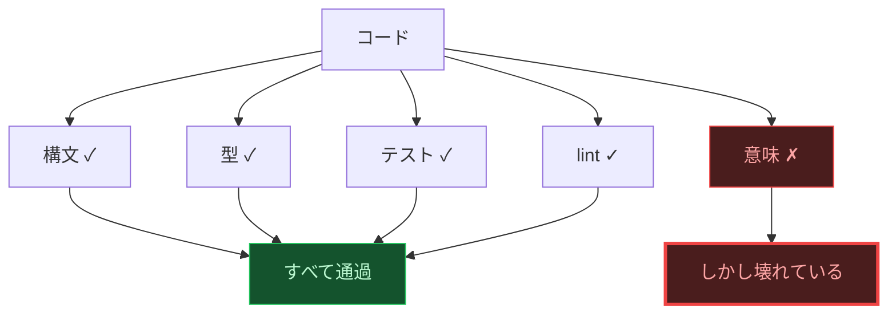

</div>

<br>

コードは言語である。

これは比喩ではない。コードは文法を持ち、語彙を持ち、文脈の中で意味を獲得する。そして自然言語と同じように、**文法的に完璧な文が、意味をなさないことがある。**

「無色の緑の考えが猛烈に眠る」— この文は英語の文法規則を完全に満たしている。主語があり、動詞があり、副詞がある。しかし意味は破綻している。コードにもまったく同じことが起きる。

```typescript
// 構文: ✓  型: ✓  テスト: ✓  lint: ✓  意味: ✗
try {
  const result = await paymentAPI.charge(amount);
  return result;
} catch (error) {
  // TODO: エラーハンドリング
}
```

この `catch` ブロックは、すべての形式検査を通過する。TypeScript は型エラーを出さない。ESLint のデフォルトルールも通す。テストはモックが正しく振る舞うから通る。しかしこのコードが「決済処理」という文脈に置かれたとき、その意味は**完全に壊れている**。エラーが起きても誰にも伝わらない。ユーザーは課金が成功したと思い込む。

> **言語の意味は、辞書に書かれた定義ではなく、実際の使われ方によって決まる。**

ジグソーパズルを想像してほしい。ピースの形状は完璧に合っている。しかしそのピースは**別のパズルのもの**だ。コンパイラが検査するのは形状の適合だけであり、絵柄の連続性ではない。

問題はこうだ。意味の破綻を見つけるには意味を理解しなければならない。しかし意味を理解するとは何か。そもそも我々は、コードの何を「知っている」と言えるのか？

<br>

---

<sup>I — 感覚的確信の貧困</sup>

「テストが通った。型チェックも通った。CI は緑だ。だからこのコードは正しい。」

これは最も直接的で、最も疑いようがなく見える知の形式だ。目の前にある緑のチェックマーク。これ以上確実なものはないように思える。

しかしこの確信は、知の形式として最も**貧しい**。

なぜか。「テストが通った」という確信をよく見ると、それは「このテストが」「このモックで」「この入力に対して」「この期待値を返した」という、きわめて限定された事実の束でしかない。直接的な確信に見えたものは、実は多くの前提によって**媒介されていた**。

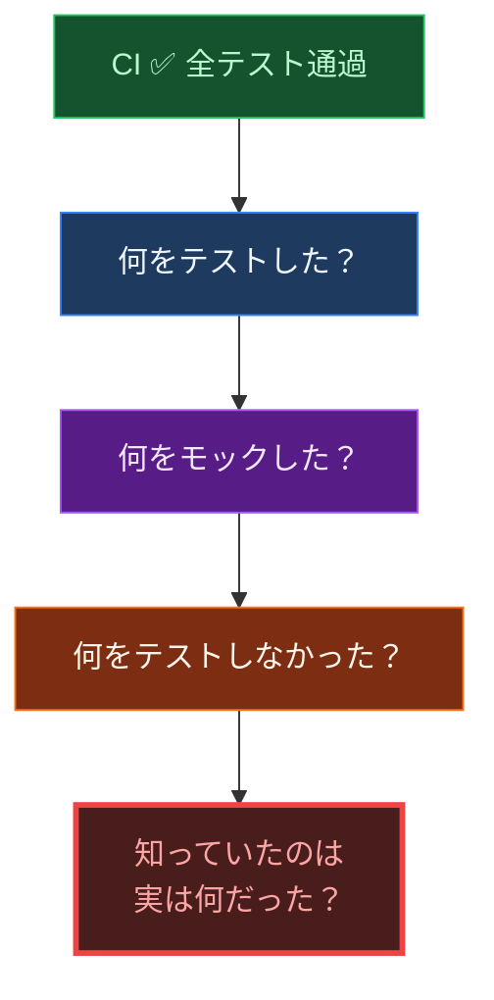

意識はここで奇妙な運動を強いられる。最も確実だと思ったもの（テスト通過）を手がかりに、一段深い理解（テストの前提条件）に進む。するとそこにも媒介がある。モックは本物の API ではない。テストデータは本物のデータではない。確信は層を剥くたびに後退し、「直接知っていた」と思ったものが、実は何重にも仮定に包まれていたことが露呈する。

型システムでも同じことが起きる。

```typescript
interface User { name: string; }
```

この宣言は「User は name を持つ」と言っている。これは確実に見える。しかし実際の API は `{ name: "太郎", nickname: "タロー", avatar: "https://..." }` を返す。型は正しい — `name` は確かに `string` だ。しかし型が語らないフィールドが存在する。語れないのではない。**語る必要を認識していない**。型の確信は、自分が何を知らないかを知らない。

知は、この自己否定の運動を通じてしか深まらない。直接的な確信が自らの貧しさを暴くとき、はじめてより深い理解への道が開かれる。

<br>

---

<sup>II — 習慣の支配と因果の幻影</sup>

テストを1000回実行した。1000回とも通った。1001回目も通るか？

我々は「通る」と答える。しかしその確信の根拠は何か。過去の規則性だけだ。「今まで通ったから次も通る」— これは推論ではない。**習慣**だ。

```typescript
const data = await fetch("/api/users");
// ↑ 過去1000回、200msで応答した
// → 1001回目も200msで応答する？
// → 根拠：過去の経験のみ
// → しかし今日、そのAPIのDBがフェイルオーバーした
```

太陽が明日昇るのは、今まで毎日昇ったからだ。APIが200msで応答するのは、今まで200msで応答してきたからだ。しかし「今までそうだった」から「これからもそうだ」を導く論理的な橋は、どこにも**存在しない**。

これは単なる哲学的遊戯ではない。本番障害の大多数はこの構造を持っている。「今まで動いていた」コードが、ある日突然壊れる。過去の観察から未来を保証することは、原理的に不可能なのだ。

さらに深い問題がある。我々は「テストが通っている」（事実の記述）から「コードは正しい」（当為の判断）を導いている。しかし**「である」から「べきである」は導けない**。

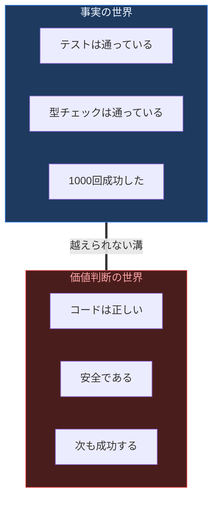

「テストが通っている」は事実だ。「コードは正しい」は価値判断だ。この二つの間には越えられない溝がある。どれだけ事実を積み上げても、価値判断には到達しない。1000回のテスト成功は1000個の事実であって、「正しさ」の証明ではない。

我々が因果だと信じているものは — クリックすれば応答がある、リクエストすれば結果が返る — 実は必然的な結合ではなく、反復された**経験の習慣**にすぎない。コードが「動いている」のは、たまたまこれまでの条件下で動いていただけかもしれない。

<br>

---

<sup>III — 生活世界の地盤</sup>

`new Date(2024, 1, 1)` は1月1日を意味するか？ — 答えは2月1日。
`"👨‍👩‍👧".length` は1か？ — 答えは8。
`0.1 + 0.2 === 0.3` か？ — 答えは `false`。

これらの「罠」を説明する前に、問いを反転させたい。なぜプログラマーは月が1から始まると信じるのか。なぜ文字列の長さは見た目の文字数だと思い込むのか。なぜ小数の足し算は正確だと前提するのか。

答え：**我々はすでに世界の中に住んでいる**からだ。

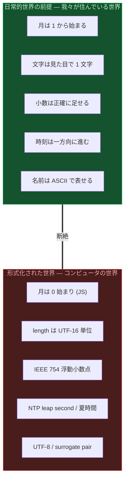

あらゆるコードを書く前に、プログラマーには「すでに生きられている世界」がある。その世界では月は1月から始まり、文字は1文字ずつ数えられ、0.1 + 0.2 は 0.3 である。この前理論的な世界 — 形式化される以前の、身体的で日常的な経験の地盤 — が、あらゆる技術的判断の無自覚な土台になっている。

しかもこの前提は単に「そこにある」のではない。我々の経験には常に**地平**がある。いまコードの一部を見ているとき、見えていない残りの部分が「地平」として意識の周縁に存在する。しかし地平は原理的に直視できない — 視線を向けた瞬間、それは地平ではなくなり、新しい地平が後退する。

コードの edge case とは、まさにこの「地平」のことだ。あるテストを書いているとき、書いていないテストが地平として存在する。しかしどのテストを書いていないかは、書こうとしない限り見えない。そして書こうとしたとき、さらに別の書いていないテストが地平に退く。

> **我々は、自分が立っている地盤を見ることができない。地盤を見るためには、そこから一歩退かねばならない。しかし退いた先もまた、別の地盤の上である。**

<br>

---

<sup>IV — 志向性と私的言語</sup>

ある開発者が「このコードは怪しい」と言うとき、その「怪しさ」は他の誰にも見えない。各人が自分の箱を持ち、中身を「甲虫」と呼んでいるが、箱を開けて比べることはできない — **私的言語の問題**だ。

しかし問題はさらに深い。

意識は常に**何かについての**意識だ。純粋な意識、対象のない意識は存在しない。コードを見るとき、意識は必ずコードの**何か**に向かっている。しかしその「何か」は開発者によって異なる。

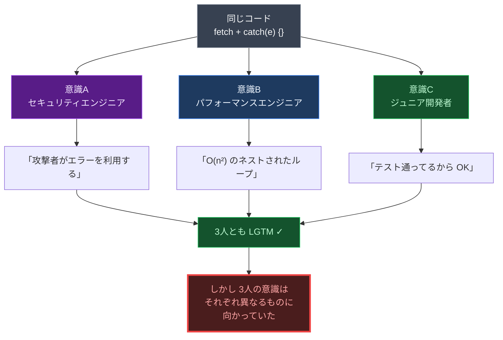

各人の意識は、コードを通じて自分の関心対象に向かっている。コード自体は同一だ。しかし意識の**向かう先**が異なるため、まったく異なるものが「見える」。コードレビューの「LGTM」は、3人が同じものを見たことを意味しない。3人がそれぞれ違うものに向かって「問題ない」と判断した、という事実を意味する。

「何かおかしい」という感覚をチームの共通基盤にすることは、二重の意味で不可能だ。第一に、各人の「おかしさ」は箱の中の甲虫であり比較できない。第二に、各人の意識はそもそも異なるものに向かっており、同じ側面を見ていない。

<br>

---

<sup>V — アスペクト盲と相関の檻</sup>

同じ絵を見ても、ウサギに見える人とアヒルに見える人がいる。コードにもまったく同じことが起きる。

```typescript
const data = await fetch("https://external-api.com/data");
const json = await data.json();
```

この2行は少なくとも3つの顔を持っている。

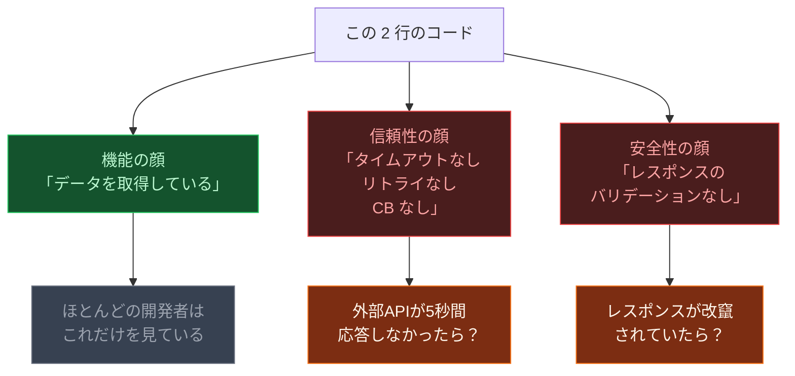

ほとんどの開発者は**機能の顔**だけを見ている。信頼性の顔を見るには「外部APIが5秒間応答しなかったら？」と問わねばならない。しかしこの問いは、問題が起きるまで思いつかない。**別の見方が存在すること自体に気づけない状態** — これがアスペクト盲だ。

ここでさらに根本的な問いが立ち上がる。

我々がコードについて知りうることは、常に何らかの**道具を通じて**知ったことでしかない。型チェッカーを通じて知った型の整合性。テストを通じて知った入出力の対応。リンターを通じて知ったパターンの逸脱。我々のコードの知は、常に道具との**相関**の内側にある。

しかし、道具を通じた知の外側にも、コードの振る舞いは存在する。

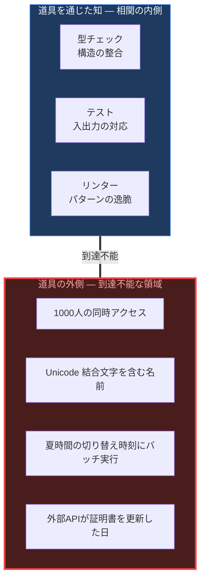

本番環境で、1000人の同時アクセスが来たときのコードの振る舞い。Unicode の結合文字を含む名前が入力されたときの振る舞い。夏時間の切り替え時刻にバッチが走ったときの振る舞い。これらは型もテストもリンターも到達しない**外部**だ。しかしそれは確実に存在する。

思考が道具を通じてしかコードにアクセスできないなら、道具の外のコードについて何を知りうるのか。何も知りえないのか。

ここで直観に反する転回が起きる。我々が確実に知りうる唯一のことは、**我々の確信が偶然的である**ということだ。型の安全性は偶然的だ — 型が保証しない領域が必ず存在する。テストの網羅性は偶然的だ — テストしなかったパスが必ず存在する。API の契約は偶然的だ — 外部チームの一人が型定義を変更すれば契約は破綻する。

しかも、この偶然性は偶然ではない。偶然性は**必然的**なのだ。あらゆるコードのあらゆる前提は「たまたまそうであるだけ」であり、何の必然的根拠もなく変化しうる。そしてこの「前提が根拠なく変化しうる」という事態だけが、唯一の必然である。

<br>

---

<sup>VI — 言語ゲームの弁証法</sup>

コードベースは単一の言語ではない。複数の**言語ゲーム**が同時進行している。

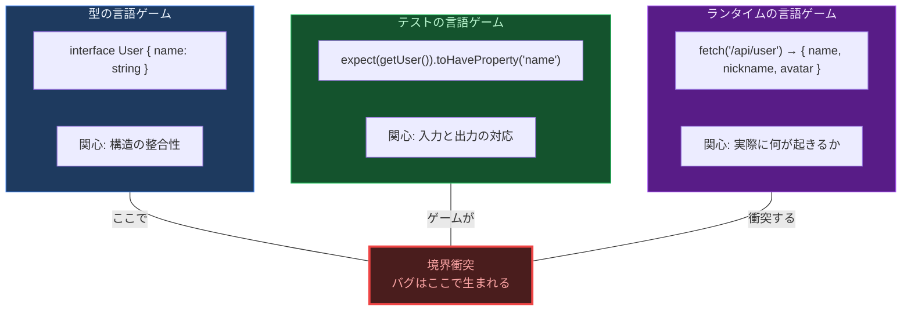

型は「構造が合っているか」というゲームを遊んでいる。テストは「この入力にこの出力が返るか」というゲームを遊んでいる。ランタイムは「実際に何が起きるか」というゲームを遊んでいる。各ゲームは自分のルール内では完璧に機能する。

しかしここに弁証法的な運動が起きている。

型チェックは「正しさ」を**定立**する — 「この構造は安全である」と。テストはその定立を**否定**する — 「型は通るが、このケースで実行すると失敗する」と。ランタイムはテストの否定をさらに否定する — 「テストでは失敗しなかったが、本番では失敗する」と。

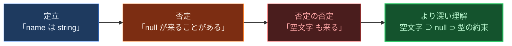

各否定は前の確信を壊すが、同時に前の確信を保存したままより広い理解に到達している。空文字の問題を理解するには null の問題を理解していなければならず、null の問題を理解するには型の約束を理解していなければならない。

**知は、自己否定の連鎖を通じてのみ深まる。** そして、どの段階も単独では**真ではない**。個々の視点 — 型チェックだけ、テストだけ、ランタイム監視だけ — はすべて**部分的**だ。

> **真なるものは全体である。** しかし全体とは、自己展開を通じて自己を完成する本質にほかならない。

<br>

---

<sup>VII — 判断停止</sup>

ではどうすればよいのか。

テストが通ったから正しい — これは習慣にすぎなかった。型が通ったから安全 — これは部分的な知にすぎなかった。コードレビューで LGTM — これは私的言語の集合にすぎなかった。過去の成功は未来を保証しない。道具の知は道具の外に到達しない。確信は偶然的であり、偶然性だけが必然だ。

ここに至って、ひとつの方法論的決断が必要になる。

**一切の前提を括弧に入れろ。**

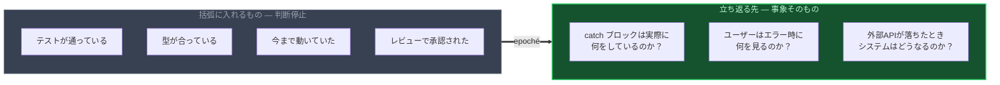

「テストが通っている」— 括弧に入れる。
「型チェックが通っている」— 括弧に入れる。
「今まで動いていた」— 括弧に入れる。
「開発者がレビューした」— 括弧に入れる。

既存のすべての判断を一度停止し、**事象そのものに立ち返る**。コードが「テストに通る」のではなく、コードが「実際に何をするか」。ユーザーが「何を経験するか」。システムが「実際にどう振る舞うか」。

これは懐疑ではない。懐疑は「何も知りえない」と言う。判断停止は「既存の判断を一度保留し、より確実な地盤を探す」と言う。破壊ではなく、**基盤の再構築**だ。

そして、事象そのものに立ち返ったとき見えるのは — `catch` ブロックが空であるという**事実**。`fetch` にタイムアウトが設定されていないという**事実**。`mutation` の後に `revalidation` がないという**事実**。これらは解釈ではない。習慣でも推論でもない。道具を通じた相関でもない。コードに書かれている（あるいは書かれていない）事実そのものだ。

<br>

---

<sup>VIII — 止揚</sup>

ここまでの道程を振り返る。

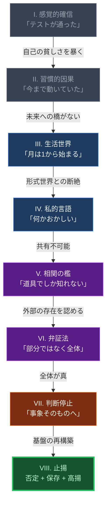

これらの否定の連鎖は、しかし、単なる破壊ではない。

**否定は、同時に保存であり、高揚である。**

```mermaid
graph LR
    subgraph Denied["否定されるもの"]
        D1["感覚的確信"]
        D2["習慣的因果"]
        D3["私的言語"]
        D4["相関の檻"]
    end

    subgraph Preserved["保存されるもの"]
        P1["テスト通過の事実\n→ grep で計測"]
        P2["過去のパターン\n→ 統計的傾向"]
        P3["違和感の直観\n→ 検出候補のシード"]
        P4["各道具の知見\n→ 交差点が真理に近づく"]
    end

    subgraph Elevated["止揚された知"]
        E1["EHD = 0.30\n(客観的事実)"]
        E2["confidence = 0.92\n(弁証法的検証)"]
        E3["CRITICAL: 即座に修正\n(全体の判断)"]
    end

    Denied --> Preserved --> Elevated

    style Denied fill:#4a1d1d,stroke:#ef4444,color:#fca5a5
    style Preserved fill:#78350f,stroke:#f59e0b,color:#fef3c7
    style Elevated fill:#14532d,stroke:#22c55e,color:#bbf7d0,stroke-width:2px
```

- 感覚的確信は否定されたが、「テスト通過」という事実は**保存される** — grep で計測できる
- 習慣的因果は否定されたが、「過去のパターン」は**保存される** — 統計的傾向として活用できる
- 私的言語は否定されたが、「違和感」という直観は**保存される** — 検出候補のシードになる
- 相関の檻は否定されたが、各道具の知見は**保存される** — 複数道具の交差点が真理に近づく

各段階を否定し、保存し、より高い次元に持ち上げる — これが**止揚**だ。

`EHD = 0.30` は「try-catch の 70% がエラーを握り潰している」という客観的事実だ。誰が測定しても `0.30` になる。これは私的言語ではない。箱の中の甲虫ではない。習慣でも推論でもない。コードに書かれている事実から直接計算された数値だ。

しかし数値だけでは足りない。grep の計測は感覚的確信と同じ罠に陥りうる — 「パターンに一致した」から「異常である」は導けない。だから LLM が弁証法的に検証する。grep の定立を、文脈理解で否定し、より高い確信（confidence score）に止揚する。

そして最終的なレポートは、単一のメトリクスではなく**全体**を提示する。Ghost と Fragile と Blind Spot。18 の QAP。10 のレイヤー。個々の数値はそれぞれ部分的だが、全体として初めて真の姿を現す。

---

<br>

<div align="center">

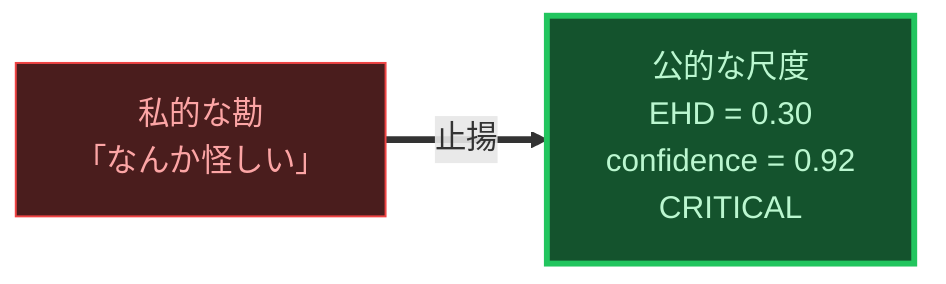

</div>

<br>

違和感とは、**言語ゲームの境界で生じる意味の断裂**である。

- ESLint は文法を検査する。意味は検査しない。
- TypeScript は構造を検査する。使用を検査しない。
- テストは特定の入力に対する出力を検査する。すべての状況を検査しない。
- レビュアーは自分の知識で検査する。知らないことは検査できない。

どのツールも、自分の言語ゲームの外側に言及できない。違和感はその外側にある。

このツールは違和感を排除しない。排除は不可能だ — 偶然性は必然だから。このツールは違和感を**計測可能にする**。私的な勘を公的な尺度に変換する。部分的な確信を全体的な評価に止揚する。習慣的な判断を事象そのものへの回帰に置き換える。

> **語りえぬものを、数えられるものに変換する。私的言語を、公的尺度に置き換える。それがこのツールの仕事である。**
