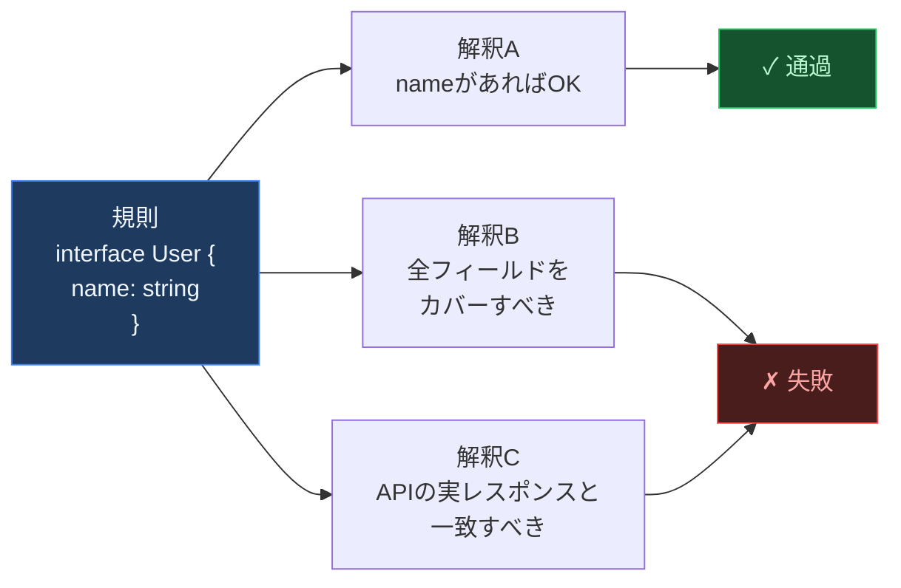
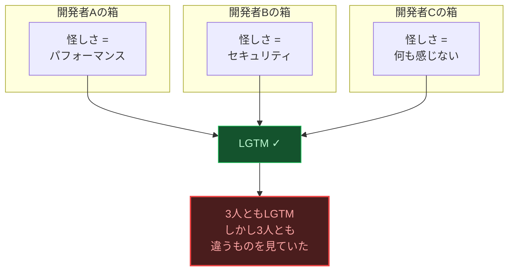
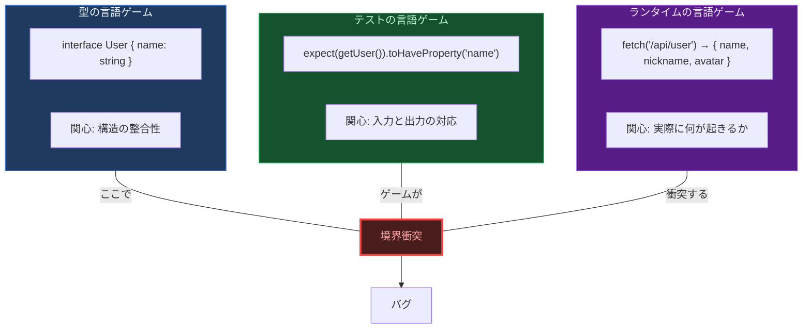
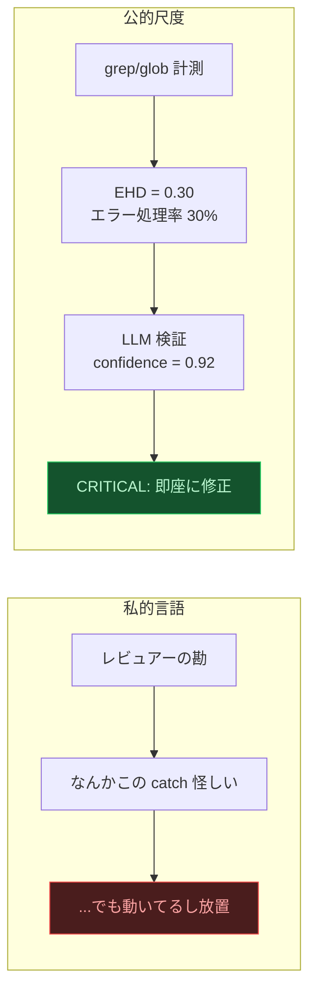

# 違和感について — ひとつの哲学的考察

<br>

コードは言語である。

これは比喩ではない。コードは文法を持ち、語彙を持ち、文脈の中で意味を獲得する。そして自然言語と同じように、**文法的に完璧な文が、意味をなさないことがある。**

「無色の緑の考えが猛烈に眠る」— この文は英語の文法規則を完全に満たしている。主語があり、動詞があり、副詞がある。しかし意味は破綻している。コードにもまったく同じことが起きる。

```typescript
// 構文: ✓  型: ✓  テスト: ✓  lint: ✓  意味: ✗
try {
  const result = await paymentAPI.charge(amount);
  return result;
} catch (error) {
  // TODO: エラーハンドリング
}
```

この `catch` ブロックは、すべての形式検査を通過する。TypeScript は型エラーを出さない。ESLint のデフォルトルールも通す。テストはモックが正しく振る舞うから通る。しかしこのコードが「決済処理」という文脈に置かれたとき、その意味は**完全に壊れている**。エラーが起きても誰にも伝わらない。ユーザーは課金が成功したと思い込む。

> **言語の意味は、辞書に書かれた定義ではなく、実際の使われ方によって決まる。**

ジグソーパズルを想像してほしい。ピースの形状は完璧に合っている。しかしそのピースは**別のパズルのもの**だ。コンパイラが検査するのは形状の適合だけであり、絵柄の連続性ではない。

<br>

---

<sup>I</sup>

型定義は `{ name: string }` と宣言する。API は実際に `{ name: "太郎", nickname: "タロー" }` を返す。型という規則は守られている — `name` は確かに `string` だ。しかし `nickname` というフィールドの存在を、型は語らない。語れない。

ここに深い逆説がある。



**どんな行為も、ある解釈のもとでは規則に合致させることができる。** テスト通過を持って「仕様どおり」と言い、型チェック通過を持って「安全」と言う。しかしそれは規則を自分に都合よく解釈しているだけかもしれない。規則は**自分自身の正しい適用を含まない**のだ。規則に従っているかどうかを判定するには規則の外に出なければならないが、規則の外に出ることは、規則がそもそも想定していない。

<br>

---

<sup>II</sup>

`new Date(2024, 1, 1)` は1月1日を意味するか？ — 答えは2月1日。 `"👨‍👩‍👧".length` は1か？ — 答えは8。 `0.1 + 0.2 === 0.3` か？ — 答えは `false`。

これらはすべて言語仕様として「正しい」動作であり、ドキュメントに明記されている。しかしその仕様の全てを知っているプログラマーは存在しない。

誰もが暗黙の前提を持っている。月は1から始まる。文字列の長さは見た目の文字数。小数の足し算は正確。これらの前提はコードに書かれず、レビューでも指摘されず、本番で沈黙のまま壊れる。

> **形式体系の内部から、その体系の限界を見ることはできない。**

<br>

---

<sup>III</sup>

ある開発者が「このコードは怪しい」と言うとき、その「怪しさ」は他の誰にも見えない。各人が自分の箱を持ち、中身を「甲虫」と呼んでいるが、箱を開けて比べることはできない — **私的言語の問題**だ。

シニアエンジニアは `catch(e) {}` を見て「危険だ」と感じる。ジュニアは「テスト通ってるから問題ない」と思う。コードレビューの「LGTM」は、実際には何を保証しているのか？



3人のレビュアーが全員 LGTM を出しても、3人が見ていたものは異なる。私的言語は共有できない。「何かおかしい」という感覚をチームの共通基盤にすることは、原理的に不可能だ。

<br>

---

<sup>IV</sup>

同じ絵を見ても、ウサギに見える人とアヒルに見える人がいる。コードにもまったく同じことが起きる。

```typescript
const data = await fetch("https://external-api.com/data");
const json = await data.json();
```

この2行は少なくとも3つの顔を持っている。

| 顔 | 見えるもの | 見えないもの |
|:---:|:---|:---|
| **機能** | データを取得している | — |
| **信頼性** | — | タイムアウトなし / リトライなし / CB なし |
| **安全性** | — | レスポンスのバリデーションなし |

ほとんどの開発者は**機能の顔**だけを見ている。信頼性の顔を見るには「外部APIが5秒間応答しなかったら？」と問わねばならない。しかしこの問いは、問題が起きるまで思いつかない。**別の見方が存在すること自体に気づけない状態** — これがアスペクト盲だ。

<br>

---

<sup>V</sup>

コードベースは単一の言語ではない。複数の**言語ゲーム**が同時進行している。



型は「構造が合っているか」というゲームを遊んでいる。テストは「この入力にこの出力が返るか」というゲームを遊んでいる。ランタイムは「実際に何が起きるか」というゲームを遊んでいる。各ゲームは自分のルール内では完璧に機能する。しかしゲーム間の境界で — 型が保証しない実行時データ、テストがカバーしない異常系 — そこに亀裂が走る。

<br>

---

<sup>VI</sup>

違和感とは、**言語ゲームの境界で生じる意味の断裂**である。

- ESLint は文法を検査する。意味は検査しない。
- TypeScript は構造を検査する。使用を検査しない。
- テストは特定の入力に対する出力を検査する。すべての状況を検査しない。
- レビュアーは自分の知識で検査する。知らないことは検査できない。

どのツールも、自分の言語ゲームの外側に言及できない。違和感はその外側にある。

だから**数値**が必要になる。



`EHD = 0.30` は「try-catch の 70% がエラーを握り潰している」という客観的事実だ。誰が測定しても `0.30` になる。箱の中の甲虫の代わりに、箱の外に置かれた物差しが要る。

> **語りえぬものを、数えられるものに変換する。私的言語を、公的尺度に置き換える。それがこのツールの仕事である。**
