# Web Anomaly Detector

**コードの「違和感」を数値で暴く** Claude Code スキル。

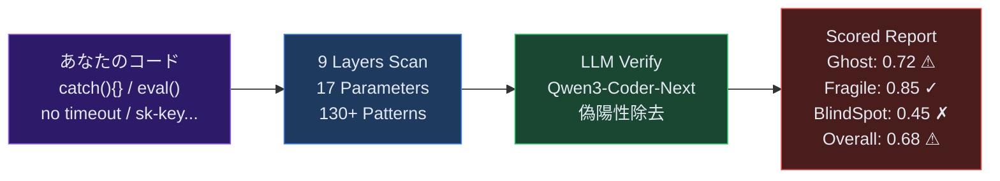

---

## 「違和感」とは何か

### ESLint が見つけないもの

コードの品質を守るツールは無数にある。ESLint, Prettier, TypeScript, テストスイート。
しかし **全部パスしても本番で壊れるコード** が存在する。

```typescript
// ESLint: ✓  TypeScript: ✓  テスト: ✓  本番: 💀
try {
  const result = await paymentAPI.charge(amount);
  return result;
} catch (error) {
  // TODO: エラーハンドリング
}
```

このコードは構文的に正しい。型も通る。テストでは `paymentAPI` がモックされているから通る。
しかし本番で決済APIが 500 を返したとき、**エラーは闇に消え、ユーザーには「成功」と表示される。**

これが **違和感** — コードは「動いている」が、何かが根本的におかしい。

### 違和感の3つの本質

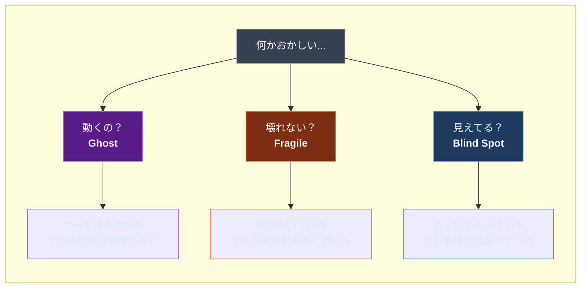

#### Ghost — 幽霊コード

**「存在するが機能しない」コード。** 見た目は正常。テストも通る。でも実際にユーザーが操作すると何も起きない。

| 症状 | 例 | なぜ危険か |
|------|-----|-----------|
| 型とAPIの不一致 | 型は `{ name }` だがAPIは `{ name, nickname }` を返す | `nickname` にアクセスすると `undefined` |
| エラー握り潰し | `catch(e) { }` で何もしない | 障害が起きても誰も気づかない |
| 誰も聴いていないイベント | サーバーが `emit("update")` するがクライアントに `on("update")` がない | リアルタイム更新が永久に届かない |
| 空のハンドラ | ボタンの `onClick` が `// TODO` | UIは反応するが処理が空 |

**なぜ既存ツールで見つからないか:** コードとしては valid。型も合っている (APIレスポンスを `any` や緩い型で受ければ)。テストはモックが正しく返すから通る。**実行時の「接続」が切れている** ことは静的解析で見つけにくい。

#### Fragile — 脆いコード

**「今は動くが、条件が変わると壊れる」コード。** 開発環境では問題なし。しかし本番のトラフィック、ネットワーク遅延、悪意あるリクエストで崩壊する。

| 症状 | 例 | なぜ危険か |
|------|-----|-----------|
| タイムアウト未設定 | `fetch(url)` にタイムアウトなし | 外部APIが遅延 → 全リクエストが詰まる |
| 秘密鍵のハードコード | `const key = "sk-proj-..."` | GitHubに公開 → 数分で不正利用 |
| N+1 クエリ | ループ内で個別 `fetch()` | 100件 = 100リクエスト → DB過負荷 |
| リトライストーム | 失敗時に即座にリトライ | 障害のAPIにさらに負荷 → 雪崩 |

**なぜ既存ツールで見つからないか:** 正常系のテストは通る。負荷テストや異常系テストがないと露呈しない。「たまたまうまくいっている」状態。

#### Blind Spot — 暗黙の前提

**「正しいと信じているが、前提が間違っている」コード。** プログラマーの知識の盲点を突く。

| 症状 | 例 | なぜ危険か |
|------|-----|-----------|
| 浮動小数点で金額計算 | `price * 1.1` (消費税) | `0.1 + 0.2 === 0.30000000000000004` |
| `.length` で文字数取得 | `"👨‍👩‍👧".length` | 答えは `8` (11ではなく) |
| 月が0始まり | `new Date(2024, 1, 1)` | 1月ではなく **2月** 1日 |
| `==` で比較 | `"0" == false` | `true` になる (型強制) |

**なぜ既存ツールで見つからないか:** 言語仕様として「正しい」動作。バグではなく **仕様の理解不足** 。ESLint の一部ルールで `==` は検出できるが、浮動小数点や Unicode の問題は検出できない。

### なぜ数値化するのか

「違和感がある」だけでは、修正の優先度をつけられない。

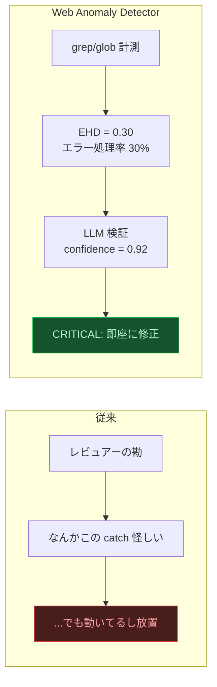

**EHD (Error Handling Density) = 0.30** は「try-catch の 70% がエラーを握り潰している」という客観的事実。
感覚ではなく数値なので、チームで共有でき、改善を追跡できる。

---

## インストール

```bash
git clone https://github.com/ohyesiamy/web-anomaly-detector.git \
  ~/.claude/skills/web-anomaly-detector
```

## 使い方

Claude Code に話しかけるだけ:

```
「このプロジェクトの違和感を探して」
「システム監査して」
「何かおかしいところはないか確認して」
```

---

## 3カテゴリ × 9レイヤー

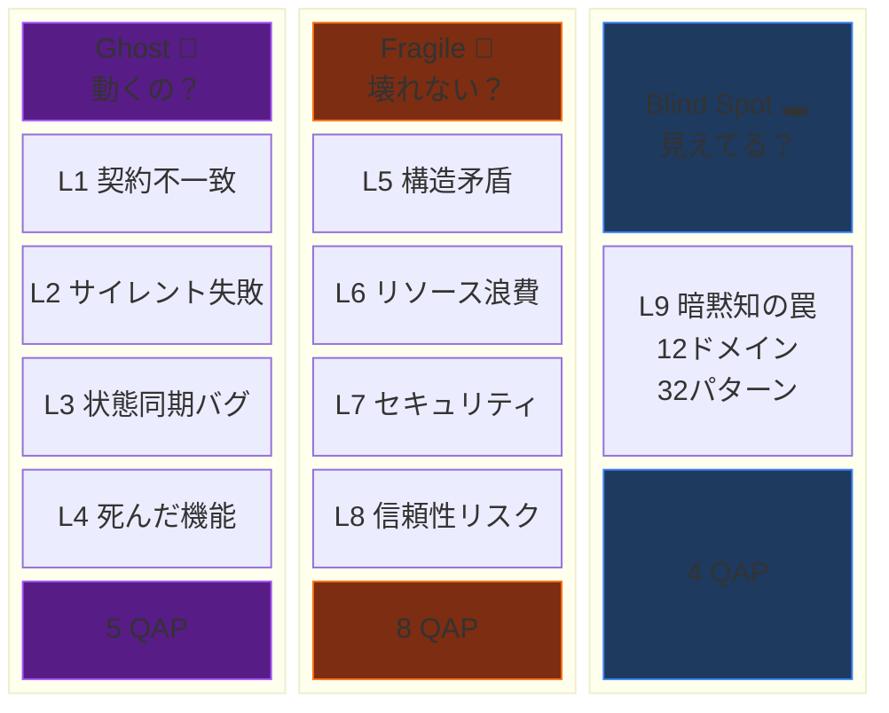

### 各レイヤーの具体例

<details>
<summary><b>L1 契約不一致</b> — 型定義と実行時データが食い違う</summary>

```typescript
// 型定義
interface User { name: string; }

// API が実際に返すデータ
{ "name": "太郎", "nickname": "タロー" }

// → nickname が型にない → user.nickname は undefined
// → CFR (Contract Fulfillment Rate) 低下
```
</details>

<details>
<summary><b>L2 サイレント失敗</b> — エラーが闇に消える</summary>

```typescript
try {
  await paymentAPI.charge(amount);
} catch (error) {
  // 何もしない ← 決済失敗がユーザーに伝わらない
}

// → EHD (Error Handling Density) 低下
```
</details>

<details>
<summary><b>L3 状態同期バグ</b> — 送信と受信が噛み合わない</summary>

```typescript
// サーバー
socket.emit("price_update", newPrice);

// クライアント — 誰も listen していない
// socket.on("price_update", ...) が存在しない

// → ESR (Event Subscription Ratio) 低下
```
</details>

<details>
<summary><b>L4 死んだ機能</b> — UIは存在するが中身が空</summary>

```vue
<button @click="handleSubmit">送信</button>

<script>
function handleSubmit() {
  // TODO: 実装する
}
</script>

<!-- ボタンを押しても何も起きない → HLR 低下 -->
```
</details>

<details>
<summary><b>L5 構造矛盾</b> — 設定が複数箇所で食い違う</summary>

```bash
# .env
API_URL=https://api.example.com

# config.ts
apiUrl: "http://localhost:3000"

# どっちが正しいの？ → CSS (Config Scatter Score) 上昇
```
</details>

<details>
<summary><b>L6 リソース浪費</b> — 知らないうちにリソースを食い尽くす</summary>

```typescript
// N+1 問題
for (const user of users) {
  const profile = await fetch(`/api/profile/${user.id}`);
}
// 100人 = 100リクエスト。1リクエストで取れるのに。
```
</details>

<details>
<summary><b>L7 セキュリティ</b> — OWASP Top 10 に該当する脆弱性</summary>

```typescript
const API_KEY = "sk-proj-abc123def456...";
// → ソースコードに秘密鍵 → GitHubに公開 → 数分で悪用
// → SEC (Secret Exposure Count) 検出
```
</details>

<details>
<summary><b>L8 信頼性リスク</b> — 正常時は見えない爆弾</summary>

```typescript
const data = await fetch("https://external-api.com/data");
// タイムアウト未設定 → 外部APIが遅延 → 全リクエスト停止
// → TCR (Timeout Coverage Ratio) 低下
```
</details>

<details>
<summary><b>L9 暗黙知の罠</b> — 正しいと信じている間違い</summary>

```typescript
const total = price * 1.1; // 消費税10%
// 0.1 + 0.2 === 0.30000000000000004
// 金額計算に浮動小数点 → 1円ズレが蓄積 → 会計不一致

"👨‍👩‍👧".length  // → 8 (見た目は1文字なのに)
new Date(2024, 1, 1) // → 2月1日 (1月じゃない)
```
</details>

---

## パイプライン (v3.2)

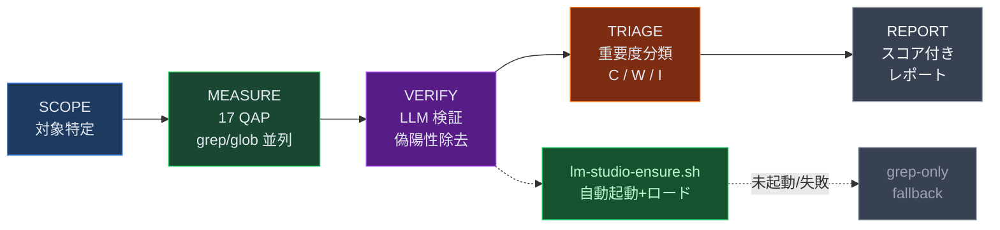

### 2-Stage 検証: なぜ LLM が必要か

grep だけでは **偽陽性** が避けられない。

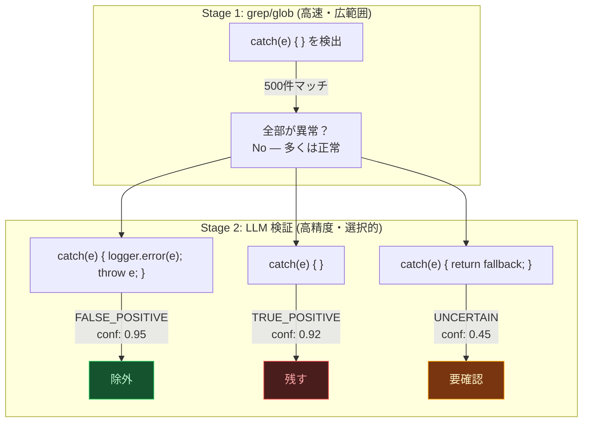

- `catch(e) { logger.error(e); throw e; }` → **偽陽性。** エラーをログに記録して再スローしている。正常。
- `catch(e) { }` → **真陽性。** 完全な握り潰し。
- `catch(e) { return fallback; }` → **判断保留。** 意図的なフォールバックかもしれない。

grep は上記を区別できないが、LLM (Qwen3-Coder-Next) はコンテキストを理解して判定する。

### LM Studio 完全自動化

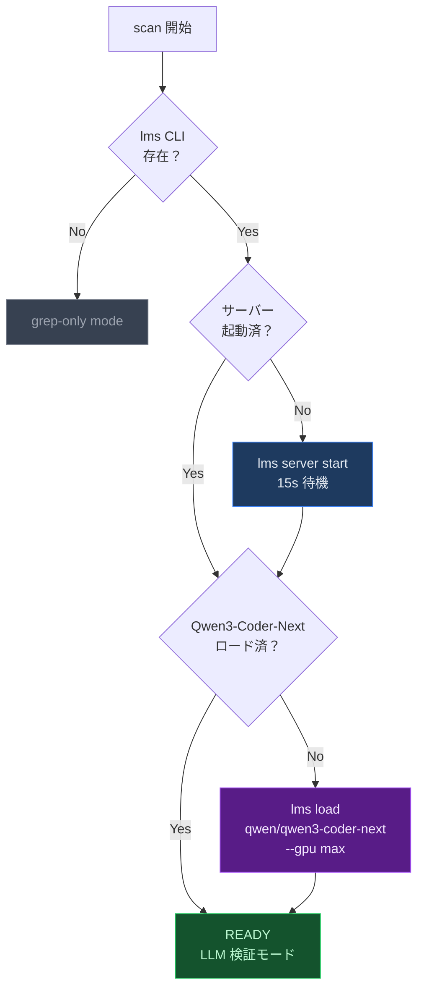

`lm-studio-ensure.sh` が全自動で実行。手動操作は一切不要。

### バージョン比較

| | v2.0 | v3.2 |
|---|---|---|
| 検出 | grep/glob のみ | grep/glob → **LLM 検証** |
| 偽陽性 | そのまま出力 | confidence score で除去 |
| スコア | raw QAP | **adjusted QAP** |
| LM Studio | — | **自動起動 + 自動ロード** |
| 後方互換 | — | `--grep-only` で v2.0 同等 |

---

## QAP: 17個の定量パラメーター

「何かおかしい」を 4 種類の計測で数値化する。

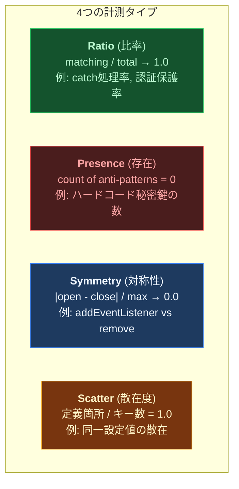

### 全パラメーター一覧

| # | QAP | 名前 | タイプ | Cat | 健全値 |
|---|-----|------|--------|-----|--------|
| 1 | **CFR** | 契約一致率 | Ratio | Ghost | → 1.0 |
| 2 | **EHD** | エラー処理率 | Ratio | Ghost | → 1.0 |
| 3 | **ESR** | イベント購読率 | Ratio | Ghost | → 1.0 |
| 4 | **HLR** | ハンドラ実装率 | Ratio | Ghost | → 1.0 |
| 5 | **RRR** | ルート到達率 | Ratio | Ghost | → 1.0 |
| 6 | **NCI** | 命名一貫性 | Ratio | Fragile | → 1.0 |
| 7 | **CSS** | 設定散在度 | Scatter | Fragile | = 1.0 |
| 8 | **TCR** | タイムアウト率 | Ratio | Fragile | → 1.0 |
| 9 | **AGC** | 認証保護率 | Ratio | Fragile | → 1.0 |
| 10 | **SEC** | 秘密鍵露出 | Presence | Fragile | = 0 |
| 11 | **RPC** | 耐障害率 | Ratio | Fragile | → 1.0 |
| 12 | **MLS** | リソース対称性 | Symmetry | Fragile | → 0.0 |
| 13 | **GSS** | シャットダウン | Presence | Fragile | = 1 |
| 14 | **TSI** | TODO放置率 | Ratio | Blind Spot | → 0.0 |
| 15 | **ITCR** | 暗黙型変換 | Presence | Blind Spot | = 0 |
| 16 | **BVG** | バリデーション欠落 | Ratio | Blind Spot | → 1.0 |
| 17 | **DFS** | 依存管理品質 | Ratio | Blind Spot | → 1.0 |

### Composite Scoring

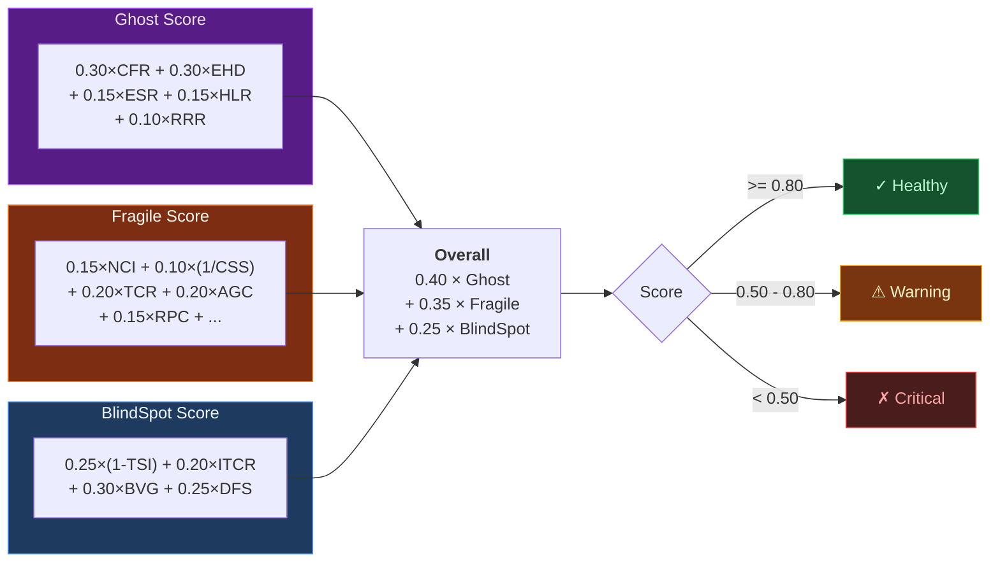

Ghost の重みが最大 (0.40) — 「動かないコード」が最も致命的だから。
Fragile (0.35) — 本番障害の直接原因。
BlindSpot (0.25) — 長期的リスク。発覚が遅いほど修正コストが膨らむ。

---

## コマンド

### `/web-anomaly-detector:scan`

```bash
/web-anomaly-detector:scan           # 全体スキャン
/web-anomaly-detector:scan diff      # git diff のみ
/web-anomaly-detector:scan path:src/ # 特定ディレクトリ
```

3つの Explore エージェントが並列で 9 レイヤーをスキャン:

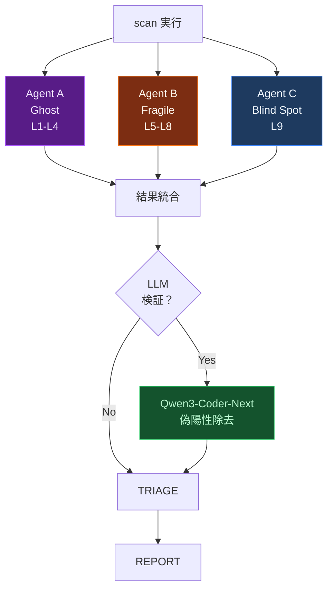

**出力例:**

```
## 違和感レポート: my-project

### Scores
| Category   | Raw  | Adjusted | Status  |
|------------|------|----------|---------|
| Ghost      | 0.72 | 0.68     | WARNING |
| Fragile    | 0.85 | 0.83     | Healthy |
| Blind Spot | 0.45 | 0.41     | CRITICAL|
| **Overall**| **0.68** | **0.64** | **WARNING** |

### CRITICAL (2件)
| # | Cat | Layer | QAP     | Conf | Location              | Symptom            |
|---|-----|-------|---------|------|-----------------------|--------------------|
| 1 | BS  | L9    | BVG=0.4 | 0.88 | server/api/user.ts:17 | バリデーションなし  |
| 2 | G   | L2    | EHD=0.3 | 0.92 | lib/api-client.ts:42  | 空 catch ブロック   |
```

### `/web-anomaly-detector:score`

QAP 数値計算のみの軽量版。パターン検出は行わない。

```bash
/web-anomaly-detector:score           # 全体
/web-anomaly-detector:score path:api/ # 特定ディレクトリ
```

---

## パッシブ検出フック

ファイル編集のたびに自動実行される軽量チェック。**非ブロッキング** — 編集を止めない。

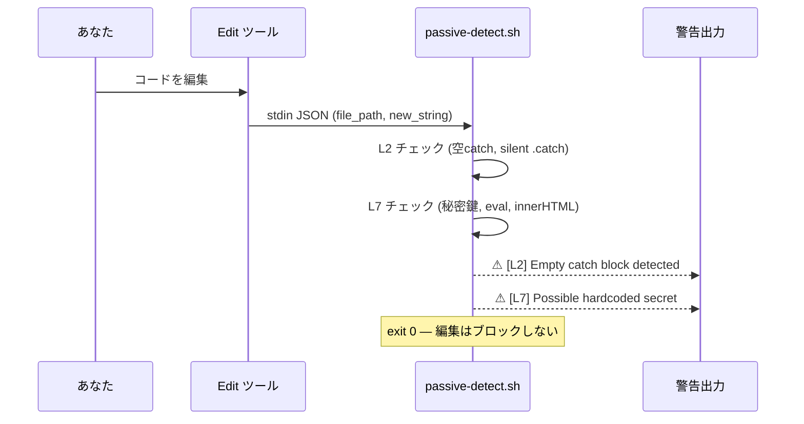

---

## Aufheben Agent

検出 → 分類 → **並列修正** → 検証を一気通貫で実行するエージェント。

```
「アウフヘーベンして」
「違和感を見つけて修正して」
```


**安全装置:**
- `git stash` でスナップショット保存
- `fix/aufheben-{timestamp}` ブランチで作業
- ビルド失敗 → 即 revert
- 1回の実行で最大 20 件まで

---

## 検出パターン: 130+

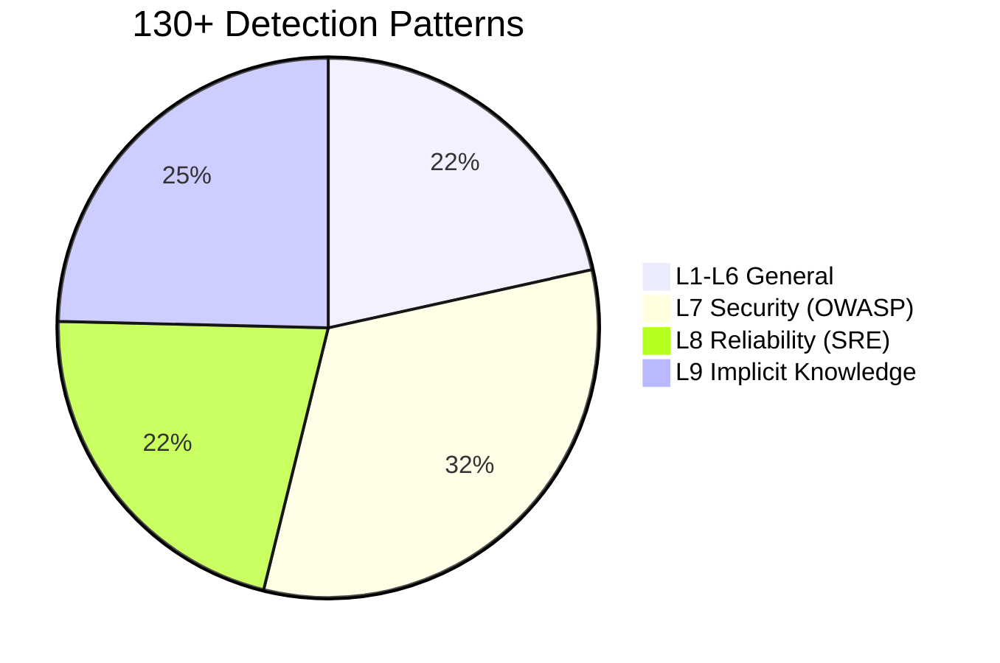

| Layer | 件数 | カバー領域 |
|-------|------|-----------|
| **L1-L6** General | 28 | 契約不一致, サイレント失敗, 状態同期, 死機能, 構造矛盾, リソース浪費 |
| **L7** Security | 42 | OWASP 2025 Top 10: アクセス制御, 暗号失敗, インジェクション, 設計, 設定 |
| **L8** Reliability | 28 | SRE パターン: Timeout, Retry Storm, Circuit Breaker, カスケード障害 |
| **L9** Implicit Knowledge | 32 | 12ドメイン: 時間/Unicode/金額/ネットワーク/DB/認証/並行処理 |

---

## 実例: 本番障害から学ぶ

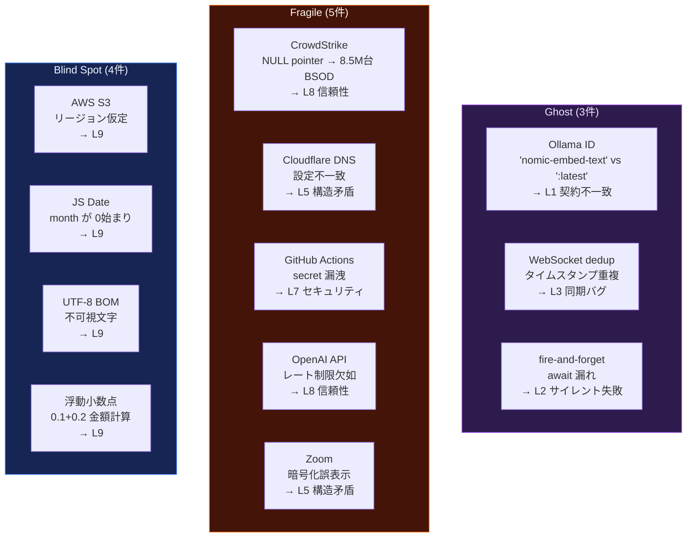

> **L8 + L9 が 12件中 8件。** 本番で初めて発覚するタイプ。
> 開発環境のテストでは絶対に見つからない。

---

## 対応フレームワーク

スタック非依存。プロジェクトを自動検出してクエリを適応。

| Frontend | Backend | Build |
|----------|---------|-------|
| Vue / Nuxt | Node / Express | pnpm |
| React / Next.js | Nitro / Hono | npm / yarn / bun |
| Svelte / Kit | Fastify / tRPC | cargo |
| Angular | Python / FastAPI | go build / pip |
| | Go / Rust | |

---

## Research Backing

| Source | 貢献 |
|--------|------|
| CK Metrics (1994) | CBO/WMC/RFC 閾値のベースライン |
| Shannon Entropy (2025) | 情報理論ベースの異常検出、60%+ precision |
| JIT Defect Prediction (2024-2025) | プロセスメトリクスの優位性を確認 |
| OWASP Top 10 (2025) | セキュリティ閾値の根拠 |
| Google SRE (2024) | 信頼性パターンの重大度根拠 |

---

## File Structure

```
web-anomaly-detector/
├── SKILL.md                        # スキル定義 (エントリポイント)
├── README.md
├── marketplace.json
├── .claude-plugin/
│   └── plugin.json                 # プラグインマニフェスト
├── commands/
│   ├── scan.md                     # /scan コマンド
│   └── score.md                    # /score コマンド
├── hooks/
│   ├── passive-detect.sh           # パッシブ検出フック
│   └── lm-studio-ensure.sh        # LM Studio 自動起動+モデルロード
└── references/
    ├── quantitative-parameters.md  # 17 QAP 定義・公式・閾値
    ├── detection-patterns.md       # L1-L6 grep/glob クエリ集
    ├── security-patterns.md        # L7: OWASP 2025 — 42 patterns
    ├── reliability-patterns.md     # L8: SRE — 28 patterns
    ├── implicit-knowledge.md       # L9: 12 domains, 32 patterns
    ├── llm-verify.md               # LLM 検証パイプライン仕様
    ├── prompts/                    # カテゴリ別 LLM 検証プロンプト
    └── case-archive.md             # 実例集: 12 本番障害
```

## License

MIT
