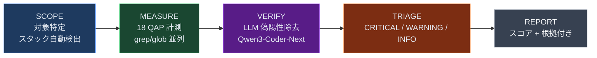
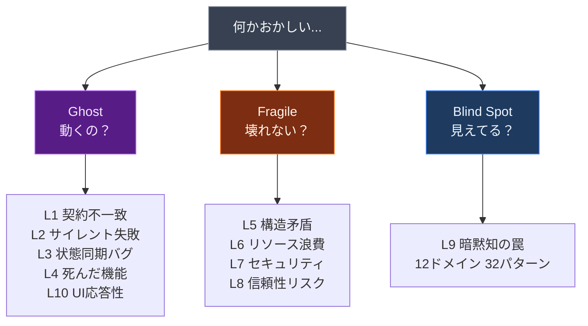
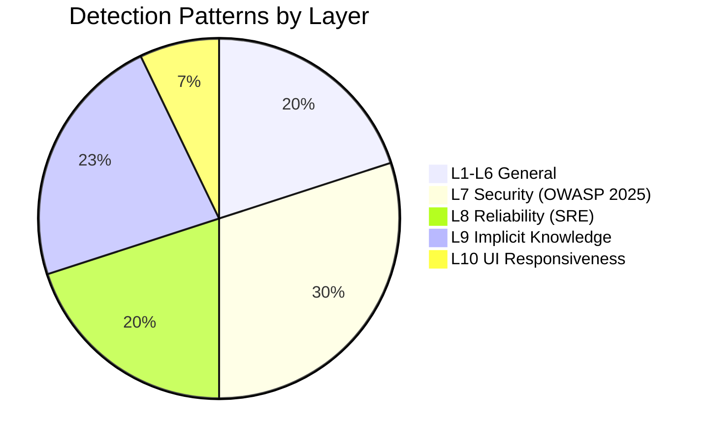

<div align="center">

[](https://buymeacoffee.com/hitakay123u)
[](https://github.com/sponsors/ohyesiamy)
[](https://github.com/ohyesiamy/web-anomaly-detector)

<br>

# Web Anomaly Detector

### コードの「違和感」を数値で暴く — Claude Code Skill

<br>

[](https://github.com/ohyesiamy/web-anomaly-detector/releases)
[](https://claude.ai/code)
[](LICENSE)
[]()
[]()

</div>

---

## なぜ必要なのか — 既存ツールが見逃す領域

あなたのプロジェクトには **ESLint がパスし、TypeScript がコンパイルし、テストが通る** のに **本番で壊れる** コードがある。

```
                          ESLint     TypeScript    テスト      本スキル
                          ───────    ──────────    ──────      ────────
空の catch ブロック          ⚠ 設定次第   ✗            ✗          ✓ L2 EHD
型定義と実装の乖離           ✗          ✗ 実行時型    ✗          ✓ L1 CFR
認証なしの API エンドポイント ✗          ✗            ✗ テスト次第 ✓ L7 AGC
mutation 後の再取得漏れ      ✗          ✗            ✗          ✓ L10 ARR
addEventListener の解除忘れ  ✗          ✗            ✗          ✓ L8 MLS
ハードコードされた API キー   ✗          ✗            ✗          ✓ L7 SEC
月の 0-indexing バグ         ✗          ✗            ✗ テスト次第 ✓ L9 ITCR
```

**本スキルの守備範囲は「開発者の感覚では何となく不安だが、既存ツールでは検出できない」領域に特化している。**

---

## Quick Start

**1. インストール** (git clone するだけ):

```bash
git clone https://github.com/ohyesiamy/web-anomaly-detector.git \
  ~/.claude/skills/web-anomaly-detector
```

**2. 使う** (Claude Code に話しかけるだけ):

```
「このプロジェクトの違和感を探して」
「システム監査して」
「何かおかしいところはないか確認して」
```

スキルが自動ロードされ、プロジェクトのスタック (Vue, React, Svelte, Go, Rust ...) を検出し、
140パターンで並列スキャンを開始する。

**3. スコアだけ見たいとき** (高速モード):

```
/web-anomaly-detector:score           # 数値だけ (パターン検出なし)
/web-anomaly-detector:score --verify  # LLM 検証付き
```

**4. 検出→修正まで一気通貫で**:

```
「アウフヘーベンして」
「違和感を見つけて全部直して」
```

---

## これが何を見つけるか — 実例

### 例1: 空の catch ブロック (L2 サイレント失敗)

```typescript
// ESLint: パス  TypeScript: パス  テスト: パス
// 本スキル: ✗ CRITICAL  EHD = 0.30  L2 サイレント失敗
try {
  const data = await fetch('/api/orders');
  return await data.json();
} catch (e) {
  // TODO: handle error later
}
// → ネットワーク障害時にユーザーには空画面が表示される。
//   エラーログも出ない。誰も気づかない。
```

### 例2: 認証なし API エンドポイント (L7 セキュリティ)

```typescript
// 10個の API エンドポイントのうち 3個に認証がない
// 本スキル: ✗ WARNING  AGC = 0.70  L7 セキュリティ
export default defineEventHandler(async (event) => {
  // ← getServerSession() がない
  const users = await db.select().from(usersTable);
  return users; // ← 全ユーザーデータが認証なしで公開
});
```

### 例3: ボタンを押しても何も起きない (L10 UI応答性)

```vue
<template>
  <!-- 本スキル: ✗ WARNING  ARR = 0.55  L10 UI応答性 -->
  <button @click="deleteItem(item.id)">削除</button>
  <!-- ← loading 表示なし、成功/失敗フィードバックなし -->
  <!-- ← リスト再取得なし → リロードしないと消えない -->
</template>

<script setup>
const deleteItem = async (id) => {
  await $fetch(`/api/items/${id}`, { method: 'DELETE' });
  // ← refreshNuxtData('items') がない
  // ← toast やフィードバック UI がない
};
</script>
```

### 例4: addEventListener の解除忘れ (L8 信頼性)

```typescript
// 本スキル: ✗ WARNING  MLS = 0.40 (Symmetry)  L8 信頼性
onMounted(() => {
  window.addEventListener('resize', handleResize);
  window.addEventListener('scroll', handleScroll);
  const interval = setInterval(pollData, 5000);
});
// onUnmounted がない → メモリリーク
// addEventListener: 2 / removeEventListener: 0 → MLS = 1.0 (異常)
```

---

## 仕組み — 2-Stage Detection Pipeline



### Stage 1: grep/glob — 金属探知機 (0 tokens, 数秒)

3つの Explore エージェントが並列起動し、140パターンを一斉スキャン:

| エージェント | 担当 | レイヤー | QAP |
|:---|:---|:---|:---|
| **Agent A** | Ghost (動かないもの) | L1-L4, L10 | CFR, EHD, ESR, HLR, RRR, ARR |
| **Agent B** | Fragile (壊れやすいもの) | L5-L8 | NCI, CSS, TCR, AGC, SEC, RPC, MLS, GSS |
| **Agent C** | Blind Spot (見えないリスク) | L9 | TSI, ITCR, BVG, DFS |

**この段階では LLM トークンを一切消費しない。** grep/glob のパターンマッチのみ。

### Stage 2: LLM — 鑑定士 (最小限 tokens)

Stage 1 の候補を Qwen3-Coder-Next (LM Studio, localhost) に送り、偽陽性を除去:

- `lm-studio-ensure.sh` がサーバー起動→モデルロード→ヘルスチェックを**全自動**
- LM Studio 未インストール時は **自動で grep-only にフォールバック** (非ブロッキング)
- 各マッチに `confidence` スコア (0.0-1.0) を付与し、QAP を補正

### Optional: DOM 検証 — ブラウザで実証 (0 Claude tokens)

L10 (UI応答性) の検出時、アプリが起動中なら `dom-verify.sh` が agent-browser で:

1. 対象ページへナビゲート
2. accessibility snapshot でインタラクティブ要素を列挙
3. 各要素をクリック → 500ms 待機 → snapshot diff
4. 変化なし = unresponsive candidate として JSON レポート出力

**Lazy 起動**: grep 候補あり + アプリ起動中 の両条件を満たしたときのみ実行。

---

## 3カテゴリ × 10レイヤー



### Ghost — 動かないもの

ユーザーから見て「機能が動いていない」状態。コードはあるのに、期待通りに動作しない。

| Layer | 検出対象 | 例 | QAP |
|:---|:---|:---|:---|
| **L1** 契約不一致 | 型定義と実行時データのズレ | `interface User { email: string }` だが API は `mail` を返す | **CFR** |
| **L2** サイレント失敗 | エラーを飲み込む catch | `catch(e) {}` — ユーザーには何も表示されない | **EHD** |
| **L3** 状態同期バグ | emit/on の不一致 | `emit('user:updated')` だが `on('user:update')` で購読 | **ESR** |
| **L4** 死んだ機能 | 宣言だけで中身のない機能 | `onClick={handleDelete}` だが `handleDelete` は TODO のみ | **HLR, RRR** |
| **L10** UI応答性 | 操作後にUIが変化しない | 削除ボタン押下→リスト更新なし→リロードしないと消えない | **ARR** |

### Fragile — 壊れやすいもの

今は動いているが、変更・負荷・攻撃で容易に壊れる。

| Layer | 検出対象 | 例 | QAP |
|:---|:---|:---|:---|
| **L5** 構造矛盾 | 設定の不整合 | API の base URL が `.env` と `config.ts` で異なる | **NCI, CSS** |
| **L6** リソース浪費 | 不要な計算やリクエスト | N+1 クエリ、100KB の未使用 import、毎フレーム再計算 | — |
| **L7** セキュリティ | OWASP 2025 Top 10 | 認証なしエンドポイント、ハードコード API キー、SQLi | **AGC, SEC** |
| **L8** 信頼性リスク | SRE パターン違反 | タイムアウト未設定、リトライなし、addEventListener 解除忘れ | **TCR, RPC, MLS, GSS** |

### Blind Spot — 見えないリスク

コードは正しく「見える」が、暗黙の前提に依存している。

| Layer | 検出対象 | 例 | QAP |
|:---|:---|:---|:---|
| **L9** 暗黙知の罠 | 12ドメイン32パターン | `new Date().getMonth()` が 0-indexed であること (0=1月) | **TSI, ITCR, BVG, DFS** |

> L9 がカバーする 12 ドメイン: 時間・タイムゾーン / Unicode・文字列 / 浮動小数点・金額 / ネットワーク / データベース / 認証・セッション / 並行処理 / ファイルシステム / 暗号 / 正規表現 / シリアライゼーション / ブラウザ API

---

## 18 QAP — 定量パラメーター

「何かおかしい」を **4つの計測タイプ** で数値化する:

| Type | 意味 | 健全値 | 異常値 | 例 |
|:---:|:---|:---:|:---:|:---|
| **Ratio** | 何割がちゃんとしてるか | → 1.0 | → 0.0 | catch 処理率 0.30 = 70%が空 |
| **Presence** | あってはいけないものの数 | = 0 | > 0 | ハードコード秘密鍵 3個 |
| **Symmetry** | 開けたら閉めたか | → 0.0 | → 1.0 | addEventListener 5 / remove 2 |
| **Scatter** | 情報が散らばっていないか | = 1.0 | > 1.5 | 同一 URL が 4ファイルに散在 |

<details>
<summary><b>全18パラメーター一覧</b></summary>

| # | QAP | 名前 | タイプ | Cat | 何を計測するか |
|:---:|:---:|:---|:---:|:---:|:---|
| 1 | **CFR** | 契約一致率 | Ratio | Ghost | 型定義 vs API 実装の一致率 |
| 2 | **EHD** | エラー処理率 | Ratio | Ghost | catch 内でエラーを適切に処理している率 |
| 3 | **ESR** | イベント購読率 | Ratio | Ghost | 定義されたイベント vs 実際に購読されている率 |
| 4 | **HLR** | ハンドラ実装率 | Ratio | Ghost | UI ハンドラが実装済み (TODO/空でない) の率 |
| 5 | **RRR** | ルート到達率 | Ratio | Ghost | 定義されたルート vs リンクから到達可能な率 |
| 6 | **ARR** | UI応答率 | Ratio | Ghost | アクション後に visible response がある率 |
| 7 | **NCI** | 命名一貫性 | Ratio | Fragile | camelCase/snake_case の混在度 |
| 8 | **CSS** | 設定散在度 | Scatter | Fragile | 同一設定値が何箇所に散在しているか |
| 9 | **TCR** | タイムアウト率 | Ratio | Fragile | HTTP リクエストにタイムアウトが設定されている率 |
| 10 | **AGC** | 認証保護率 | Ratio | Fragile | API エンドポイントが認証で保護されている率 |
| 11 | **SEC** | 秘密鍵露出 | Presence | Fragile | ソースコード内のハードコード秘密鍵の数 |
| 12 | **RPC** | 耐障害率 | Ratio | Fragile | 外部呼び出しにリトライ/CB がある率 |
| 13 | **MLS** | リソース対称性 | Symmetry | Fragile | open/close ペアの対称性 (リーク検出) |
| 14 | **GSS** | シャットダウン | Presence | Fragile | SIGTERM/graceful shutdown の実装有無 |
| 15 | **TSI** | TODO放置率 | Ratio | BlindSpot | 90日以上放置された TODO の比率 |
| 16 | **ITCR** | 暗黙型変換 | Presence | BlindSpot | `==` / `!=` (非厳密比較) の使用数 |
| 17 | **BVG** | バリデーション欠落 | Ratio | BlindSpot | サーバー入力にバリデーションがある率 |
| 18 | **DFS** | 依存管理品質 | Ratio | BlindSpot | lockfile + pinned deps + 安全な scripts |

</details>

### Composite Score

```
Overall = 0.40 × Ghost + 0.35 × Fragile + 0.25 × BlindSpot

>= 0.80  Healthy    — 問題なし
0.50-0.80 Warning   — 改善が望ましい
< 0.50   Critical   — 即座に対処すべき
```

LLM 検証後: `adjusted_QAP = raw_QAP × (0.5 + 0.5 × avg_confidence)`

---

## 出力例

```
## 違和感レポート: my-nuxt-app

### Mode
LLM-verified (Qwen3-Coder-Next / 47件検証)

### Scores
| Category    | Raw  | Adjusted | Status   |
|-------------|------|----------|----------|
| Ghost       | 0.72 | 0.68     | WARNING  |
| Fragile     | 0.85 | 0.83     | Healthy  |
| Blind Spot  | 0.45 | 0.41     | CRITICAL |
| **Overall** | **0.68** | **0.64** | **WARNING** |

### CRITICAL (2件)
| # | Cat | Layer | QAP      | Conf | Location               | Symptom                    | Root Cause                  |
|---|-----|-------|----------|------|------------------------|----------------------------|-----------------------------|
| 1 | BS  | L9    | BVG=0.40 | 0.88 | server/api/user.ts:17  | readBody() にバリデーションなし | Zod スキーマが未適用           |
| 2 | G   | L2    | EHD=0.30 | 0.92 | lib/api-client.ts:42   | 空 catch: エラー握り潰し       | TODO コメントのみで未実装       |

### WARNING (5件)
| # | Cat | Layer | QAP      | Conf | Location               | Symptom                    | Root Cause                  |
|---|-----|-------|----------|------|------------------------|----------------------------|-----------------------------|
| 1 | G   | L10   | ARR=0.55 | 0.85 | pages/items.vue:31     | 削除後にリスト未更新            | refreshNuxtData() 欠如       |
| 2 | F   | L7    | AGC=0.70 | 0.90 | server/api/admin.ts:5  | 認証ガードなし                | getServerSession() 未呼び出し |
| 3 | F   | L8    | MLS=0.40 | 0.78 | composables/useWS.ts:8 | addEventListener 解除忘れ    | onUnmounted 未実装           |
| ... |

### LLM Verification Summary
| Metric                 | Value    |
|------------------------|----------|
| Total grep matches     | 127      |
| LLM verified           | 47       |
| True positives         | 38       |
| False positives removed | 9       |
| Avg confidence         | 0.84     |
```

---

## 140 検出パターン



### パターン Tier 分類

各パターンには検出精度に基づく Tier が割り当てられている:

| Tier | 意味 | 検出方法 | 例 |
|:---:|:---|:---|:---|
| **A** | grep だけで高精度 | パターンマッチのみ | `catch(e) {}` (空 catch) |
| **B** | grep + LLM で確定 | grep で候補 → LLM で判定 | 「このハンドラは意図的に空か？」 |
| **C** | LLM 専用 | 文脈理解が必須 | 「この状態管理は適切か？」 |

L10 の 10 パターンは **5A / 3B / 2C** — 半数が grep だけで高精度検出可能。

---

## コマンド一覧

| コマンド | 説明 | 速度 |
|:---|:---|:---:|
| `/web-anomaly-detector:scan` | 全体スキャン (3並列エージェント + LLM検証) | ~30s |
| `/web-anomaly-detector:scan diff` | git diff で変更ファイルのみ | ~10s |
| `/web-anomaly-detector:scan path:src/api` | 特定ディレクトリのみ | ~10s |
| `/web-anomaly-detector:scan --grep-only` | LLM 検証なし (v2互換) | ~5s |
| `/web-anomaly-detector:score` | QAP 数値のみ (パターン検出なし) | ~3s |
| `/web-anomaly-detector:score --verify` | QAP + LLM 検証 | ~15s |

自然言語でも起動可能:

```
「違和感を探して」「矛盾がないか確認して」「システム監査して」「何かおかしい」
```

---

## Aufheben Agent — 検出から修正まで

検出→分類→並列修正→検証を一気通貫で実行する外部エージェント。


```
「アウフヘーベンして」
「違和感を見つけて修正して」
```

**安全装置**: `git stash` → `fix/aufheben-{timestamp}` ブランチ → ビルド失敗時 revert → 最大 20件/回

---

## パッシブ検出 — 編集するたびに自動チェック

`PostToolUse:Edit` フックにより、ファイルを編集するたびに **L2 (サイレント失敗)** と **L7 (セキュリティ)** を自動チェック。

- **非ブロッキング**: 編集を止めない。問題があれば警告を表示するだけ
- **対象**: 直前に編集したファイルのみ (全体スキャンではない)
- **検出例**: `catch(e) {}` の追加、`password = "..."` のハードコード

---

## 対応フレームワーク

スタック非依存。`package.json` / `Cargo.toml` / `go.mod` 等からプロジェクトを自動検出し、
フレームワーク固有のパターンを適用する。

| Frontend | Backend | Language |
|:---|:---|:---|
| Vue / Nuxt 3-4 | Node / Express / Nitro | TypeScript / JavaScript |
| React / Next.js | Hono / Fastify / tRPC | Go |
| Svelte / SvelteKit | Python / FastAPI / Django | Rust |
| Angular | Ruby on Rails | Python |

---

## LLM 検証 — ローカル完結

外部 API に一切送信しない。全て localhost で完結する。

| 項目 | 値 |
|:---|:---|
| **推論エンジン** | LM Studio (localhost:1234) |
| **モデル** | Qwen3-Coder-Next (自動ロード) |
| **自動化** | `lm-studio-ensure.sh` がサーバー+モデルを全自動管理 |
| **フォールバック** | 未インストール → grep-only (非ブロッキング) |
| **データ送信先** | なし (ローカルのみ) |

---

## File Structure

```
web-anomaly-detector/
├── SKILL.md                        # エントリポイント (~100行)
├── ABSTRACT.md                     # 哲学的考察 — 違和感の認識論
├── .claude-plugin/plugin.json      # プラグインマニフェスト
├── marketplace.json                # マーケットプレイス掲載情報
│
├── commands/
│   ├── scan.md                     # /scan — 全体スキャン + レポート
│   └── score.md                    # /score — QAP 数値のみ (軽量)
│
├── hooks/
│   ├── passive-detect.sh           # Edit 後の L2+L7 パッシブ検出
│   ├── lm-studio-ensure.sh         # LM Studio サーバー+モデル自動管理
│   └── dom-verify.sh               # agent-browser DOM 応答性検証
│
└── references/
    ├── quantitative-parameters.md  # 18 QAP 定義・公式・閾値
    ├── detection-patterns.md       # L1-L6, L10 汎用パターン
    ├── uiux-semiotics.md           # L10: 論理哲学/記号論/認知心理/行動経済
    ├── security-patterns.md        # L7: OWASP 2025 Top 10 (42パターン)
    ├── reliability-patterns.md     # L8: SRE/Chaos Engineering (28パターン)
    ├── implicit-knowledge.md       # L9: 12ドメイン (32パターン)
    ├── llm-verify.md               # LLM 検証パイプライン仕様
    ├── prompts/                    # カテゴリ別 LLM 検証プロンプト
    └── case-archive.md             # 実例: 12件の本番障害分析
```

---

## Research

本スキルの閾値・重み・分類は以下の研究に基づいている:

| Source | 貢献 |
|:---|:---|
| CK Metrics (Chidamber & Kemerer 1994) | CBO/WMC/RFC ベースの複雑度閾値 |
| Shannon Entropy (2025 Springer) | 情報理論ベース異常検出 |
| OWASP Top 10 (2025) + API Security (2023) | セキュリティパターン・閾値 |
| Google SRE Handbook (2024) | 信頼性パターン・重大度分類 |
| Bayesian Defect Prediction (Fenton 2012) | 欠陥予測の統計モデル |

> **[違和感について — ひとつの哲学的考察](ABSTRACT.md)**: 感覚的確信の貧困、因果の幻影、生活世界の地盤、判断停止、止揚 — 「違和感」の認識論を8章で考察。

---

<div align="center">

<sub>Source Available Commercial License (SACL-1.0) — Personal use free / Commercial use requires license</sub>

<sub>語りえぬものを、数えられるものに変換する。</sub>

</div>
