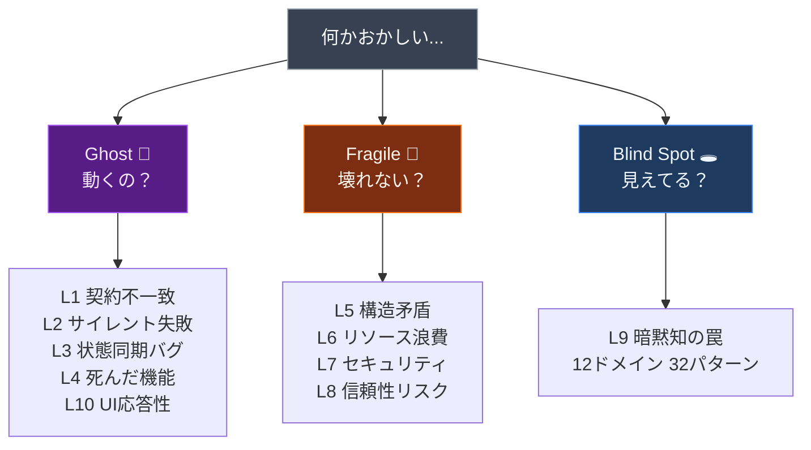
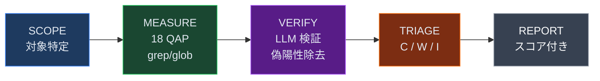
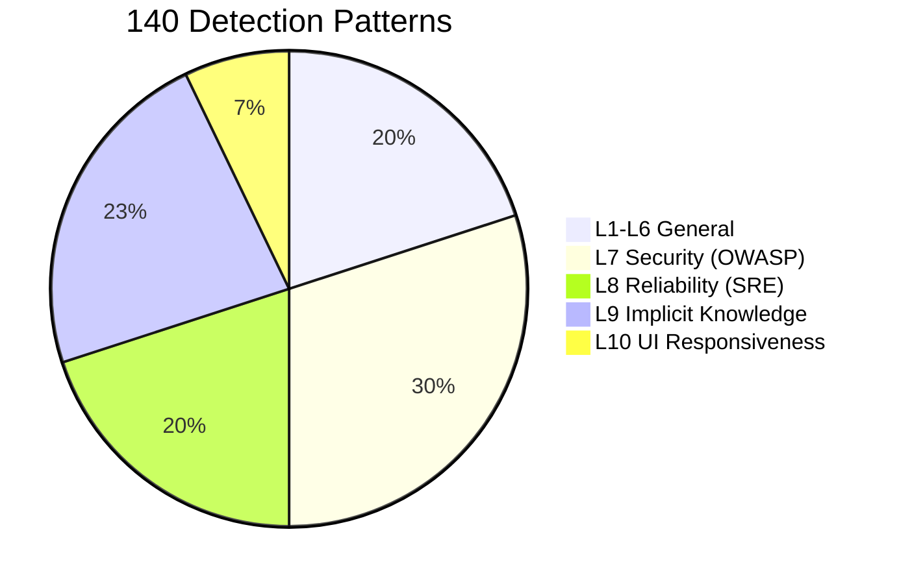

<div align="center">

[](https://buymeacoffee.com/hitakay123u)
[](https://github.com/sponsors/ohyesiamy)
[](https://github.com/ohyesiamy/web-anomaly-detector)

<br>

# Web Anomaly Detector

### コードの「違和感」を数値で暴く

<br>

[](https://github.com/ohyesiamy/web-anomaly-detector/releases)
[](https://claude.ai/code)
[](LICENSE)
[]()
[]()

<br>


ESLint が見逃し、TypeScript が保証できず、テストがカバーしない領域を暴く。

</div>

---

> **語りえぬものを、数えられるものに変換する。私的言語を、公的尺度に置き換える。**
>
> — [違和感について — ひとつの哲学的考察](ABSTRACT.md)

---

## Quick Start

```bash
git clone https://github.com/ohyesiamy/web-anomaly-detector.git \
  ~/.claude/skills/web-anomaly-detector
```

Claude Code に話しかけるだけ:

```
「このプロジェクトの違和感を探して」
「システム監査して」
「何かおかしいところはないか確認して」
```

---

## 3カテゴリ × 10レイヤー



| Cat | Layer | 何を検出するか | アナロジー |
|:---:|:---|:---|:---|
|  | **L1** 契約不一致 | 型定義と実行時データの食い違い | 地図に載っていない道路 |
|  | **L2** サイレント失敗 | エラーが闇に消える catch ブロック | 火災報知器の電池抜き |
|  | **L3** 状態同期バグ | emit と on の不一致 | 留守番電話に話し続ける |
|  | **L4** 死んだ機能 | TODO だけのハンドラ | 商品のないボタン |
|  | **L10** UI応答性 | 操作後にUIが変わらない | 注文後に無言のウェイター |
|  | **L5** 構造矛盾 | 設定が複数箇所で食い違う | 2つの時計が違う時刻 |
|  | **L6** リソース浪費 | N+1クエリ、巨大ペイロード | 1品ずつレジに並ぶ |
|  | **L7** セキュリティ | OWASP 2025 Top 10 (42パターン) | 鍵をドアマットの下に |
|  | **L8** 信頼性リスク | タイムアウト未設定、CB欠如 | ブレーキのない車 |
|  | **L9** 暗黙知の罠 | 浮動小数点、Unicode、月0始まり | 常識がコンピュータと違う |

---

## 検出パイプライン



**2-Stage**: grep は金属探知機（全ての金属に反応）、LLM は鑑定士（価値あるコインか空き缶か判定）。

- **LM Studio 自動化**: `lm-studio-ensure.sh` がサーバー起動→モデルロード→ヘルスチェックを全自動。未インストール時は grep-only にフォールバック
- **DOM 検証**: `dom-verify.sh` が agent-browser で実際のクリック → accessibility snapshot diff を実行。アプリ未起動時は自動フォールバック
- **並列スキャン**: 3つの Explore エージェントが Ghost / Fragile / BlindSpot を同時スキャン

---

## 18 QAP (定量パラメーター)

4つの計測タイプで「何かおかしい」を数値化:

| Type | 意味 | 健全値 | 例 |
|:---:|:---|:---:|:---|
| **Ratio** | 何割がちゃんとしてるか | → 1.0 | catch 処理率、認証保護率 |
| **Presence** | あってはいけないものの数 | = 0 | ハードコード秘密鍵 |
| **Symmetry** | 開けたら閉めたか | → 0.0 | addEventListener vs remove |
| **Scatter** | 情報が散らばっていないか | = 1.0 | 同一設定値の散在 |

<details>
<summary><b>全パラメーター一覧</b></summary>

| # | QAP | 名前 | タイプ | Cat | 健全値 |
|:---:|:---:|:---|:---:|:---:|:---:|
| 1 | **CFR** | 契約一致率 | Ratio | Ghost | → 1.0 |
| 2 | **EHD** | エラー処理率 | Ratio | Ghost | → 1.0 |
| 3 | **ESR** | イベント購読率 | Ratio | Ghost | → 1.0 |
| 4 | **HLR** | ハンドラ実装率 | Ratio | Ghost | → 1.0 |
| 5 | **RRR** | ルート到達率 | Ratio | Ghost | → 1.0 |
| 6 | **ARR** | UI応答率 | Ratio | Ghost | → 1.0 |
| 7 | **NCI** | 命名一貫性 | Ratio | Fragile | → 1.0 |
| 8 | **CSS** | 設定散在度 | Scatter | Fragile | = 1.0 |
| 9 | **TCR** | タイムアウト率 | Ratio | Fragile | → 1.0 |
| 10 | **AGC** | 認証保護率 | Ratio | Fragile | → 1.0 |
| 11 | **SEC** | 秘密鍵露出 | Presence | Fragile | = 0 |
| 12 | **RPC** | 耐障害率 | Ratio | Fragile | → 1.0 |
| 13 | **MLS** | リソース対称性 | Symmetry | Fragile | → 0.0 |
| 14 | **GSS** | シャットダウン | Presence | Fragile | = 1 |
| 15 | **TSI** | TODO放置率 | Ratio | BlindSpot | → 0.0 |
| 16 | **ITCR** | 暗黙型変換 | Presence | BlindSpot | = 0 |
| 17 | **BVG** | バリデーション欠落 | Ratio | BlindSpot | → 1.0 |
| 18 | **DFS** | 依存管理品質 | Ratio | BlindSpot | → 1.0 |

</details>

### Composite Scoring

```
Overall = 0.40 × Ghost + 0.35 × Fragile + 0.25 × BlindSpot

Ghost   = 0.25×CFR + 0.25×EHD + 0.10×ESR + 0.15×ARR + 0.10×HLR + 0.10×RRR + 0.05×reserve
Fragile = 0.15×NCI + 0.10×(1/CSS) + 0.20×TCR + 0.20×AGC + 0.10×(1-SEC') + 0.10×RPC + 0.10×(1-MLS) + 0.05×GSS
BlindSpot = 0.25×(1-TSI) + 0.20×ITCR_norm + 0.30×BVG + 0.25×DFS

>= 0.80 Healthy  |  0.50-0.80 Warning  |  < 0.50 Critical
```

LLM 検証後の補正: `adjusted_QAP = raw_QAP × (0.5 + 0.5 × avg_confidence)`

---

## コマンド

```bash
/web-anomaly-detector:scan              # 全体スキャン
/web-anomaly-detector:scan diff         # git diff のみ
/web-anomaly-detector:scan path:src/    # 特定ディレクトリ
/web-anomaly-detector:score             # QAP 数値のみ (軽量)
/web-anomaly-detector:score --verify    # LLM 検証付き
```

<details>
<summary><b>出力例</b></summary>

```
## 違和感レポート: my-project

### Scores
| Category   | Raw  | Adjusted | Status  |
|------------|------|----------|---------|
| Ghost      | 0.72 | 0.68     | WARNING |
| Fragile    | 0.85 | 0.83     | Healthy |
| Blind Spot | 0.45 | 0.41     | CRITICAL|
| **Overall**| **0.68** | **0.64** | **WARNING** |

### CRITICAL (2件)
| # | Cat | Layer | QAP     | Conf | Location              | Symptom           |
|---|-----|-------|---------|------|-----------------------|-------------------|
| 1 | BS  | L9    | BVG=0.4 | 0.88 | server/api/user.ts:17 | バリデーションなし |
| 2 | G   | L2    | EHD=0.3 | 0.92 | lib/api-client.ts:42  | 空 catch ブロック  |
```

</details>

---

## 140 検出パターン



| Layer | 件数 | カバー領域 |
|:---|:---:|:---|
| **L1-L6** | 28 | 契約不一致, サイレント失敗, 状態同期, 死機能, 構造矛盾, リソース浪費 |
| **L7** Security | 42 | OWASP 2025 Top 10: アクセス制御, 暗号失敗, インジェクション |
| **L8** Reliability | 28 | SRE: Timeout, Retry Storm, Circuit Breaker, カスケード障害 |
| **L9** Implicit | 32 | 12ドメイン: 時間/Unicode/金額/ネットワーク/DB/認証/並行処理 |
| **L10** UI | 10 | Action-Feedback断絶, 写像欠落, アフォーダンス, ダークパターン (5A/3B/2C) |

> **L10 Tier**: A = grep 高精度 (P10.1-P10.4, P10.9) / B = grep + LLM 検証 (P10.5, P10.7, P10.8) / C = LLM 専用 (P10.6, P10.10)

---

## Aufheben Agent

検出→分類→並列修正→検証を一気通貫で実行する。

```
「アウフヘーベンして」
「違和感を見つけて修正して」
```


安全装置: `git stash` → `fix/aufheben-{timestamp}` ブランチ → ビルド失敗時 revert → 最大 20件/回

---

## パッシブ検出フック

ファイル編集のたびに L2 (サイレント失敗) と L7 (セキュリティ) を自動チェック。非ブロッキング。

---

## 対応フレームワーク

スタック非依存。プロジェクトを自動検出してクエリを適応。

| Frontend | Backend | Build |
|:---|:---|:---|
| Vue / Nuxt | Node / Express / Nitro | pnpm / npm / yarn / bun |
| React / Next.js | Hono / Fastify / tRPC | cargo / go build / pip |
| Svelte / Kit | Python / FastAPI / Go / Rust | |

---

## File Structure

```
web-anomaly-detector/
├── SKILL.md                        # エントリポイント
├── .claude-plugin/plugin.json      # プラグインマニフェスト
├── commands/
│   ├── scan.md                     # /scan コマンド
│   └── score.md                    # /score コマンド
├── hooks/
│   ├── passive-detect.sh           # パッシブ検出
│   ├── lm-studio-ensure.sh        # LM Studio 自動起動
│   └── dom-verify.sh              # agent-browser DOM 検証
└── references/
    ├── quantitative-parameters.md  # 18 QAP 定義・公式・閾値
    ├── detection-patterns.md       # L1-L6, L10 (140 patterns)
    ├── uiux-semiotics.md           # L10: 論理哲学/記号論/認知心理/行動経済
    ├── security-patterns.md        # L7: OWASP 2025 (42 patterns)
    ├── reliability-patterns.md     # L8: SRE (28 patterns)
    ├── implicit-knowledge.md       # L9: 12 domains (32 patterns)
    ├── llm-verify.md               # LLM 検証パイプライン
    ├── prompts/                    # LLM 検証プロンプト
    └── case-archive.md             # 実例: 12 本番障害
```

---

## Research

| Source | 貢献 |
|:---|:---|
| CK Metrics (Chidamber & Kemerer 1994) | CBO/WMC/RFC 閾値 |
| Shannon Entropy (2025 Springer) | 情報理論ベース異常検出 |
| OWASP Top 10 (2025) | セキュリティ閾値 |
| Google SRE (2024) | 信頼性パターン重大度 |

---

<div align="center">

<sub>Source Available Commercial License (SACL-1.0) — Personal use free / Commercial use requires license</sub>

<sub>語りえぬものを、数えられるものに変換する。</sub>

</div>
