<div align="center">

# Web Anomaly Detector

### コードの「違和感」を数値で暴く

<br>

[](https://github.com/ohyesiamy/web-anomaly-detector/releases)
[](https://claude.ai/code)
[](LICENSE)
[]()
[]()

<br>

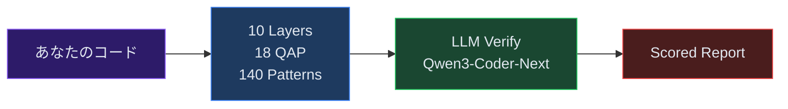

<sub>ESLint が見逃し、TypeScript が保証できず、テストがカバーしない領域を、grep と LLM で暴く。</sub>

</div>

<br>

---

<br>

## 違和感について — ひとつの哲学的考察

<br>

コードは言語である。

これは比喩ではない。コードは文法を持ち、語彙を持ち、文脈の中で意味を獲得する。そして自然言語と同じように、**文法的に完璧な文が、意味をなさないことがある。**

「無色の緑の考えが猛烈に眠る」— この文は英語の文法規則を完全に満たしている。主語があり、動詞があり、副詞がある。しかし意味は破綻している。コードにもまったく同じことが起きる。

```typescript
// 構文: ✓  型: ✓  テスト: ✓  lint: ✓  意味: ✗
try {
  const result = await paymentAPI.charge(amount);
  return result;
} catch (error) {
  // TODO: エラーハンドリング
}
```

この `catch` ブロックは、すべての形式検査を通過する。TypeScript は型エラーを出さない。ESLint のデフォルトルールも通す。テストはモックが正しく振る舞うから通る。しかしこのコードが「決済処理」という文脈に置かれたとき、その意味は**完全に壊れている**。エラーが起きても誰にも伝わらない。ユーザーは課金が成功したと思い込む。

> **言語の意味は、辞書に書かれた定義ではなく、実際の使われ方によって決まる。**

ジグソーパズルを想像してほしい。ピースの形状は完璧に合っている。しかしそのピースは**別のパズルのもの**だ。コンパイラが検査するのは形状の適合だけであり、絵柄の連続性ではない。

<br>

---

<sup>I</sup>

型定義は `{ name: string }` と宣言する。API は実際に `{ name: "太郎", nickname: "タロー" }` を返す。型という規則は守られている — `name` は確かに `string` だ。しかし `nickname` というフィールドの存在を、型は語らない。語れない。

ここに深い逆説がある。

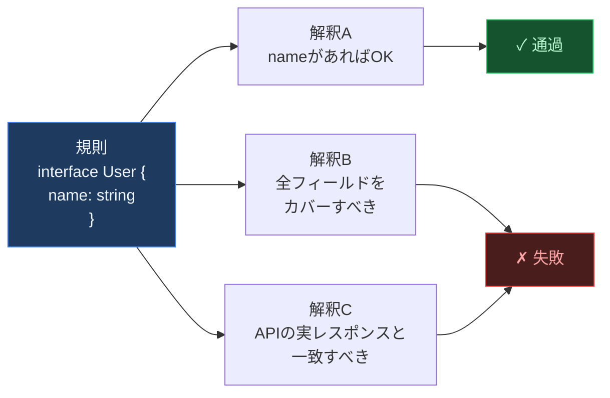

**どんな行為も、ある解釈のもとでは規則に合致させることができる。** テスト通過を持って「仕様どおり」と言い、型チェック通過を持って「安全」と言う。しかしそれは規則を自分に都合よく解釈しているだけかもしれない。規則は**自分自身の正しい適用を含まない**のだ。規則に従っているかどうかを判定するには規則の外に出なければならないが、規則の外に出ることは、規則がそもそも想定していない。

<br>

---

<sup>II</sup>

`new Date(2024, 1, 1)` は1月1日を意味するか？ — 答えは2月1日。 `"👨‍👩‍👧".length` は1か？ — 答えは8。 `0.1 + 0.2 === 0.3` か？ — 答えは `false`。

これらはすべて言語仕様として「正しい」動作であり、ドキュメントに明記されている。しかしその仕様の全てを知っているプログラマーは存在しない。

誰もが暗黙の前提を持っている。月は1から始まる。文字列の長さは見た目の文字数。小数の足し算は正確。これらの前提はコードに書かれず、レビューでも指摘されず、本番で沈黙のまま壊れる。

> **形式体系の内部から、その体系の限界を見ることはできない。**

<br>

---

<sup>III</sup>

ある開発者が「このコードは怪しい」と言うとき、その「怪しさ」は他の誰にも見えない。各人が自分の箱を持ち、中身を「甲虫」と呼んでいるが、箱を開けて比べることはできない — **私的言語の問題**だ。

シニアエンジニアは `catch(e) {}` を見て「危険だ」と感じる。ジュニアは「テスト通ってるから問題ない」と思う。コードレビューの「LGTM」は、実際には何を保証しているのか？

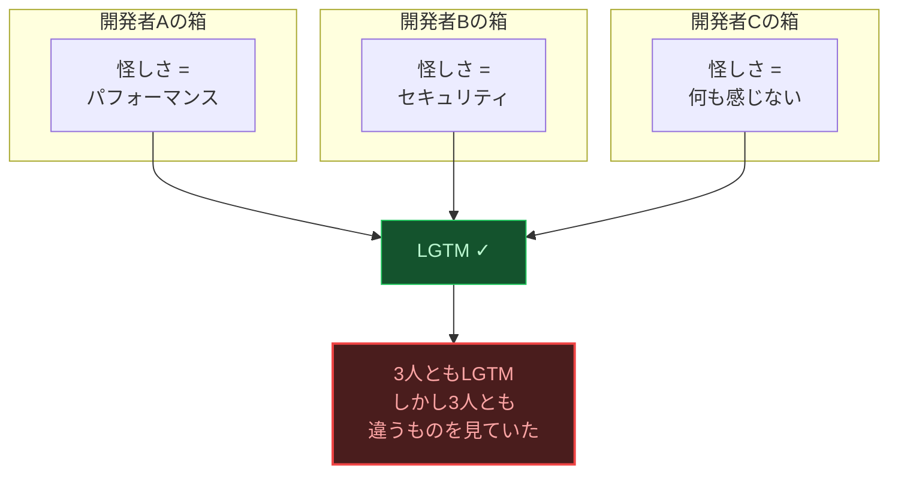

3人のレビュアーが全員 LGTM を出しても、3人が見ていたものは異なる。私的言語は共有できない。「何かおかしい」という感覚をチームの共通基盤にすることは、原理的に不可能だ。

<br>

---

<sup>IV</sup>

同じ絵を見ても、ウサギに見える人とアヒルに見える人がいる。コードにもまったく同じことが起きる。

```typescript
const data = await fetch("https://external-api.com/data");
const json = await data.json();
```

この2行は少なくとも3つの顔を持っている。

| 顔 | 見えるもの | 見えないもの |
|:---:|:---|:---|
| **機能** | データを取得している | — |
| **信頼性** | — | タイムアウトなし / リトライなし / CB なし |
| **安全性** | — | レスポンスのバリデーションなし |

ほとんどの開発者は**機能の顔**だけを見ている。信頼性の顔を見るには「外部APIが5秒間応答しなかったら？」と問わねばならない。しかしこの問いは、問題が起きるまで思いつかない。**別の見方が存在すること自体に気づけない状態** — これがアスペクト盲だ。

<br>

---

<sup>V</sup>

コードベースは単一の言語ではない。複数の**言語ゲーム**が同時進行している。

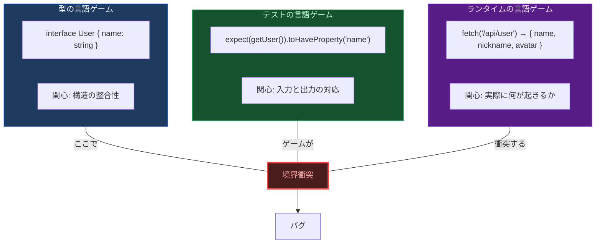

型は「構造が合っているか」というゲームを遊んでいる。テストは「この入力にこの出力が返るか」というゲームを遊んでいる。ランタイムは「実際に何が起きるか」というゲームを遊んでいる。各ゲームは自分のルール内では完璧に機能する。しかしゲーム間の境界で — 型が保証しない実行時データ、テストがカバーしない異常系 — そこに亀裂が走る。

<br>

---

<sup>VI</sup>

違和感とは、**言語ゲームの境界で生じる意味の断裂**である。

- ESLint は文法を検査する。意味は検査しない。
- TypeScript は構造を検査する。使用を検査しない。
- テストは特定の入力に対する出力を検査する。すべての状況を検査しない。
- レビュアーは自分の知識で検査する。知らないことは検査できない。

どのツールも、自分の言語ゲームの外側に言及できない。違和感はその外側にある。

だから**数値**が必要になる。

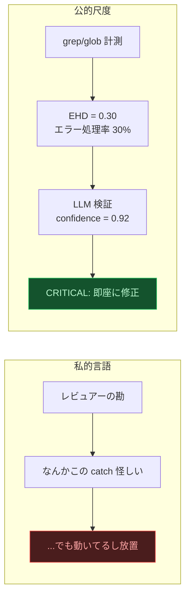

`EHD = 0.30` は「try-catch の 70% がエラーを握り潰している」という客観的事実だ。誰が測定しても `0.30` になる。箱の中の甲虫の代わりに、箱の外に置かれた物差しが要る。

> **語りえぬものを、数えられるものに変換する。私的言語を、公的尺度に置き換える。それがこのツールの仕事である。**

<br>

---

<br>

## Quick Start

```bash
git clone https://github.com/ohyesiamy/web-anomaly-detector.git \
  ~/.claude/skills/web-anomaly-detector
```

Claude Code に話しかけるだけ:

```
「このプロジェクトの違和感を探して」
「システム監査して」
「何かおかしいところはないか確認して」
```

<br>

---

<br>

## 3つの問い

<div align="center">

違和感は3つの問いに分解される。

</div>

<br>

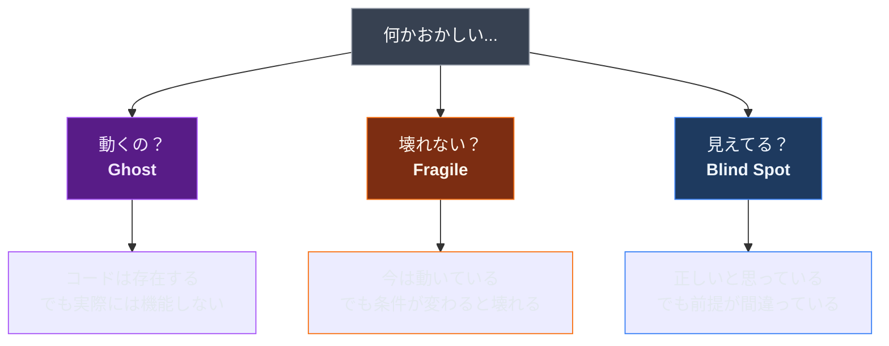

<br>

###  L1–L4, L10

> 舞台の上に役者がいる。台詞もある。照明も当たっている。しかし**マイクの電源が入っていない。**

「存在するが機能しない」コード。見た目は正常。テストも通る。でも実際にユーザーが操作すると何も起きない。

| 症状 | 例 | アナロジー |
|:---|:---|:---|
| 型とAPIの不一致 | 型は `{ name }` だがAPIは `{ name, nickname }` を返す | 地図に載っていない道路 |
| エラー握り潰し | `catch(e) { }` で何もしない | 火災報知器の電池抜き |
| 誰も聴いていないイベント | `emit("update")` するが `on("update")` がない | 留守番電話に話し続ける |
| 空のハンドラ | `onClick` が `// TODO` | 押しても何も起きないエレベーターのボタン |
| 操作後無反応 | DELETE 後にリスト更新なし | 注文したのにウェイターが何も言わない |

> [!IMPORTANT]
> **なぜ既存ツールで見つからないか:** コードとしては valid。型も合っている。テストはモックが正しく返すから通る。**実行時の「接続」が切れている**ことは静的解析で見つけにくい。

<br>

###  L5–L8

> 晴れた日に橋を渡る。問題なし。しかしこの橋は**台風を想定して設計されていない。**

「今は動くが、条件が変わると壊れる」コード。開発環境では問題なし。しかし本番のトラフィック、ネットワーク遅延、悪意あるリクエストで崩壊する。

| 症状 | 例 | アナロジー |
|:---|:---|:---|
| タイムアウト未設定 | `fetch(url)` にタイムアウトなし | ブレーキのない車で高速道路 |
| 秘密鍵ハードコード | `const key = "sk-proj-..."` | 玄関の鍵をドアマットの下に |
| N+1 クエリ | ループ内で個別 `fetch()` | 100人分の注文を1つずつ厨房に伝える |
| リトライストーム | 失敗時に即座にリトライ | 倒れた人をさらに叩き起こす |

> [!WARNING]
> **なぜ既存ツールで見つからないか:** 正常系のテストは通る。負荷テストや異常系テストがないと露呈しない。「たまたまうまくいっている」だけ。

<br>

###  L9

> あなたは右ハンドルの車で左側通行の国にいる。すべてが正常に見える。しかし**あなたがいるのはアメリカだ。**

「正しいと信じているが、前提が間違っている」コード。プログラマーの知識の盲点を突く。

| 症状 | 例 | アナロジー |
|:---|:---|:---|
| 浮動小数点で金額計算 | `price * 1.1` | 定規の目盛りが微妙にずれている |
| `.length` で文字数 | `"👨‍👩‍👧‍👦".length` → `11` | 1世帯を「1人」と数える |
| 月が0始まり | `new Date(2024, 1, 1)` → 2月 | 1階がground floorの国 |
| `==` で比較 | `"0" == false` → `true` | 「同じ」の定義が相手と違う |

> [!CAUTION]
> **なぜ既存ツールで見つからないか:** 言語仕様として「正しい」動作。バグではなく**仕様の理解不足**。ESLint で `==` は検出できるが、浮動小数点や Unicode は検出できない。

<br>

---

<br>

## アーキテクチャ: 3 × 10

<div align="center">

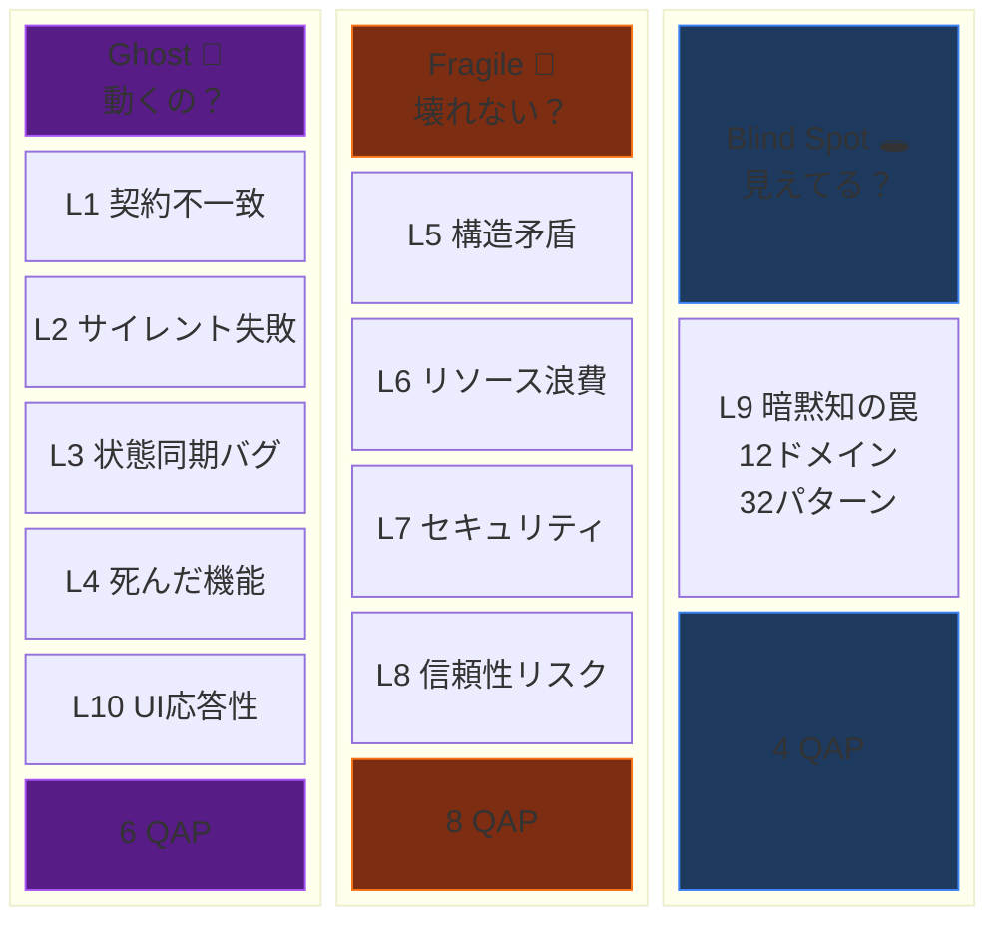

</div>

<details>
<summary><b>L1 契約不一致</b> — 型定義と実行時データが食い違う</summary>

> 契約書にサインしたが、実際の取引内容が違う

```typescript
// 型定義
interface User { name: string; }
// API が実際に返すデータ
{ "name": "太郎", "nickname": "タロー" }
// → nickname が型にない → user.nickname は undefined
// → CFR (Contract Fulfillment Rate) 低下
```

</details>

<details>
<summary><b>L2 サイレント失敗</b> — エラーが闇に消える</summary>

> 煙感知器が煙を検知した。しかしアラームの配線が切れている

```typescript
try {
  await paymentAPI.charge(amount);
} catch (error) {
  // 何もしない ← 決済失敗がユーザーに伝わらない
}
// → EHD (Error Handling Density) 低下
```

</details>

<details>
<summary><b>L3 状態同期バグ</b> — 送信と受信が噛み合わない</summary>

> ラジオ局が放送しているが、誰もその周波数にチューニングしていない

```typescript
// サーバー
socket.emit("price_update", newPrice);
// クライアント — 誰も listen していない
// socket.on("price_update", ...) が存在しない
// → ESR (Event Subscription Ratio) 低下
```

</details>

<details>
<summary><b>L4 死んだ機能</b> — UIは存在するが中身が空</summary>

> 自動販売機にボタンがある。押せる。しかし中に商品が入っていない

```vue
<button @click="handleSubmit">送信</button>
<script>
function handleSubmit() {
  // TODO: 実装する
}
</script>
<!-- ボタンを押しても何も起きない → HLR 低下 -->
```

</details>

<details>
<summary><b>L5 構造矛盾</b> — 設定が複数箇所で食い違う</summary>

> 2つの時計が違う時刻を指している。どちらが正しい？

```bash
# .env
API_URL=https://api.example.com
# config.ts
apiUrl: "http://localhost:3000"
# → CSS (Config Scatter Score) 上昇
```

</details>

<details>
<summary><b>L6 リソース浪費</b> — 知らないうちにリソースを食い尽くす</summary>

> スーパーで1品ずつレジに並ぶ。100品あるのに

```typescript
for (const user of users) {
  const profile = await fetch(`/api/profile/${user.id}`);
}
// 100人 = 100リクエスト。1リクエストで取れるのに
```

</details>

<details>
<summary><b>L7 セキュリティ</b> — OWASP Top 10 に該当する脆弱性</summary>

> 金庫の暗証番号を金庫の上に貼り付けている

```typescript
const API_KEY = "sk-proj-abc123def456...";
// → ソースコードに秘密鍵 → GitHubに公開 → 数分で悪用
// → SEC (Secret Exposure Count) 検出
```

</details>

<details>
<summary><b>L8 信頼性リスク</b> — 正常時は見えない爆弾</summary>

> 消火器のない建物。火事が起きなければ誰も気づかない

```typescript
const data = await fetch("https://external-api.com/data");
// タイムアウト未設定 → 外部APIが遅延 → 全リクエスト停止
// → TCR (Timeout Coverage Ratio) 低下
```

</details>

<details>
<summary><b>L9 暗黙知の罠</b> — 12ドメイン・32パターン</summary>

> あなたの常識は、コンピュータの常識ではない

```typescript
const total = price * 1.1; // 消費税10%
// 0.1 + 0.2 === 0.30000000000000004
// 金額計算に浮動小数点 → 1円ズレが蓄積

"👨‍👩‍👧".length  // → 8 (見た目は1文字)
new Date(2024, 1, 1) // → 2月1日 (1月じゃない)
```

12ドメイン: 時間 / Unicode / 金額 / ネットワーク / DB / 認証 / 並行処理 / OS / DNS / ファイルシステム / 暗号 / 正規表現

</details>

<details>
<summary><b>L10 UI応答性</b> — ボタンを押しても何も変わらない</summary>

> 注文したのに、ウェイターが何も言わずに立ち去った

```typescript
// DELETE でアイテム削除
await $fetch('/api/items', { method: 'DELETE', body: { id } });
// ← リスト更新なし。リロードしないと反映されない
// → ARR (Action-Response Rate) 低下
```

3層検出: grep (0 tokens) → agent-browser DOM 検証 (0 Claude tokens) → LLM 判定 (最小限 tokens)

</details>

<br>

---

<br>

## パイプライン

<div align="center">

> 医者は最初に広範囲の検査（血液検査・X線）で異常を見つけ、
> 次に専門検査（MRI・生検）で確定診断する。
> このツールも同じだ。

</div>

<br>

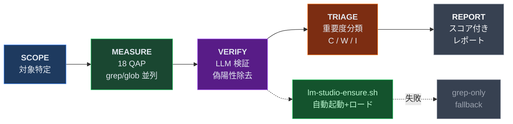

### なぜ 2 Stage なのか

> [!TIP]
> grep は**金属探知機**。すべての金属に反応する。コインも、鍵も、アルミ缶も。
> LLM は**鑑定士**。「これは価値あるコインか、ただの空き缶か」を判定する。

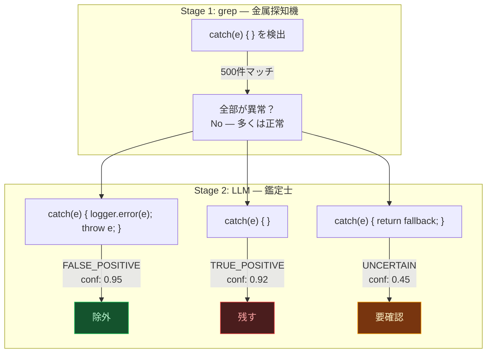

### LM Studio 完全自動化

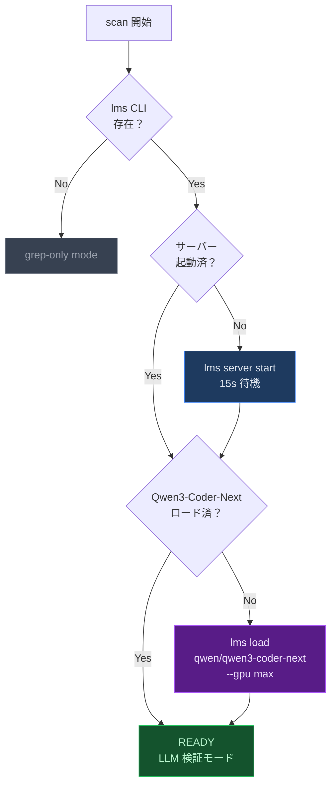

> [!NOTE]
> `lm-studio-ensure.sh` がサーバー起動 → モデルロード → ヘルスチェックを全自動で実行。LM Studio がインストールされていなければ自動的に grep-only モードにフォールバック。

### DOM 応答性検証 (L10)

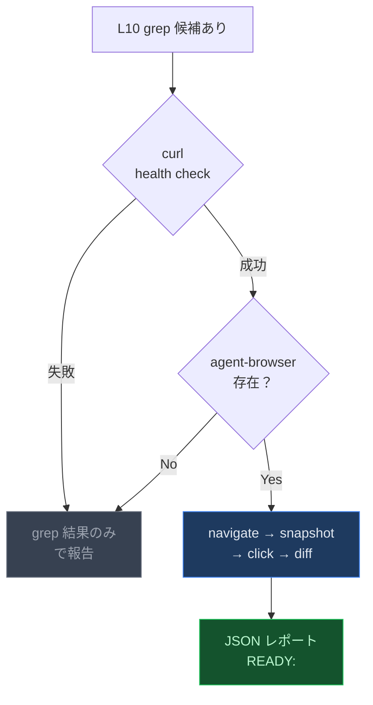

> [!NOTE]
> `dom-verify.sh` が agent-browser で実際のクリック → accessibility snapshot diff を実行。アプリ未起動時は自動的に grep-only にフォールバック (非ブロッキング)。

### バージョン比較

| | v2.0 | v3.3 |
|:---:|:---|:---|
| **検出** | grep/glob のみ | grep/glob → **LLM 検証** |
| **偽陽性** | そのまま出力 | confidence score で除去 |
| **スコア** | raw QAP | **adjusted QAP** |
| **LM Studio** | — | **自動起動 + 自動ロード** |
| **UI応答性** | — | **L10: agent-browser DOM 検証** |
| **後方互換** | — | `--grep-only` で v2.0 同等 |

<br>

---

<br>

## QAP: 18個の定量パラメーター

<div align="center">

> 体温計が1本では「なんとなく熱い」しかわからない。
> 体温・血圧・血中酸素・心拍の**18項目**を測れば、どこが悪いか特定できる。

</div>

<br>

### 4つの計測タイプ

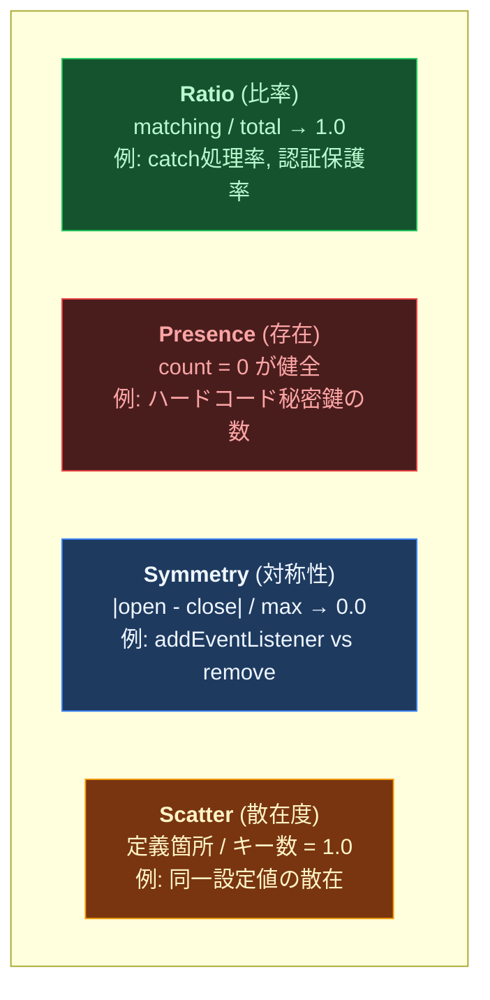

> [!TIP]
> **Ratio** = 「何割がちゃんとしてるか」（体温のように目標値がある）
> **Presence** = 「あってはいけないものの数」（がん細胞は0であるべき）
> **Symmetry** = 「開けたら閉めたか」（蛇口を開けたら閉める）
> **Scatter** = 「情報が散らばっていないか」（薬をバラバラに保管するな）

### 全パラメーター一覧

| # | QAP | 名前 | タイプ | Cat | 健全値 |
|:---:|:---:|:---|:---:|:---:|:---:|
| 1 | **CFR** | 契約一致率 | Ratio |  | → 1.0 |
| 2 | **EHD** | エラー処理率 | Ratio |  | → 1.0 |
| 3 | **ESR** | イベント購読率 | Ratio |  | → 1.0 |
| 4 | **HLR** | ハンドラ実装率 | Ratio |  | → 1.0 |
| 5 | **RRR** | ルート到達率 | Ratio |  | → 1.0 |
| 6 | **ARR** | UI応答率 | Ratio |  | → 1.0 |
| 7 | **NCI** | 命名一貫性 | Ratio |  | → 1.0 |
| 8 | **CSS** | 設定散在度 | Scatter |  | = 1.0 |
| 9 | **TCR** | タイムアウト率 | Ratio |  | → 1.0 |
| 10 | **AGC** | 認証保護率 | Ratio |  | → 1.0 |
| 11 | **SEC** | 秘密鍵露出 | Presence |  | = 0 |
| 12 | **RPC** | 耐障害率 | Ratio |  | → 1.0 |
| 13 | **MLS** | リソース対称性 | Symmetry |  | → 0.0 |
| 14 | **GSS** | シャットダウン | Presence |  | = 1 |
| 15 | **TSI** | TODO放置率 | Ratio |  | → 0.0 |
| 16 | **ITCR** | 暗黙型変換 | Presence |  | = 0 |
| 17 | **BVG** | バリデーション欠落 | Ratio |  | → 1.0 |
| 18 | **DFS** | 依存管理品質 | Ratio |  | → 1.0 |

### Composite Scoring

> [!NOTE]
> 各カテゴリのスコアは重み付き平均で算出される。Ghost が最も重い (0.40) — 「そもそも動かないコード」が最も致命的だから。

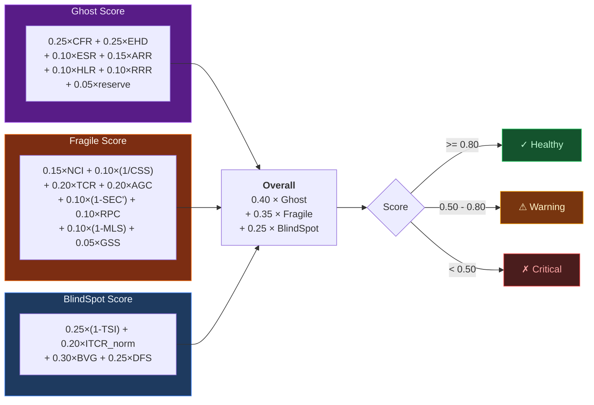

<details>
<summary><b>LLM Confidence による補正</b></summary>

$$\text{adjusted\_QAP} = \text{raw\_QAP} \times (0.5 + 0.5 \times \text{avg\_confidence})$$

| avg_confidence | 乗数 | 効果 |
|:---:|:---:|:---|
| 1.0 | 1.00 | 変化なし（全件が真の異常） |
| 0.8 | 0.90 | 10% 緩和 |
| 0.5 | 0.75 | 25% 緩和（未検証デフォルト） |
| 0.0 | 0.50 | 50% に低下（完全否定でも半分保持） |

> grep 検出の価値を完全には否定しない設計。最低でも raw の 50% を保持する。

</details>

<br>

---

<br>

## コマンド

### `/web-anomaly-detector:scan`

```bash
/web-anomaly-detector:scan           # 全体スキャン
/web-anomaly-detector:scan diff      # git diff のみ
/web-anomaly-detector:scan path:src/ # 特定ディレクトリ
```

3つの Explore エージェントが**並列**で 10 レイヤーをスキャン:

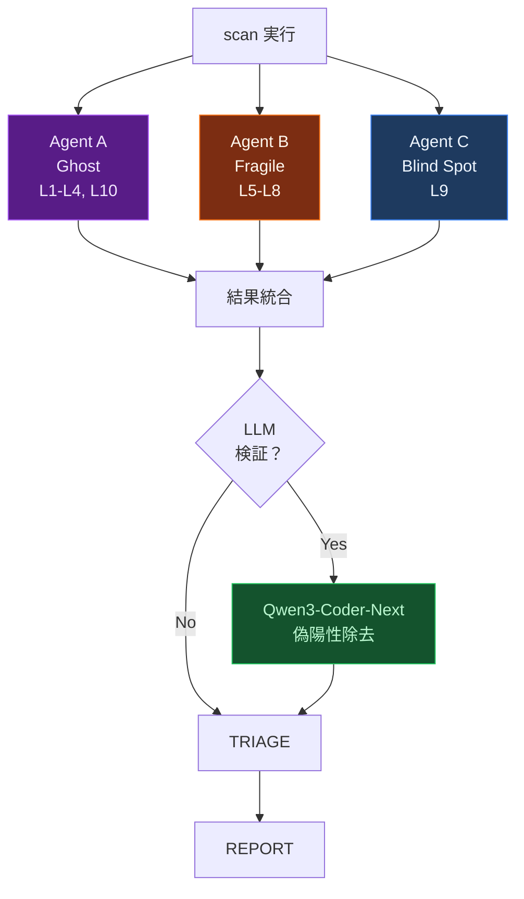

<details>
<summary><b>出力例</b></summary>

```
## 違和感レポート: my-project

### Scores
| Category   | Raw  | Adjusted | Status  |
|------------|------|----------|---------|
| Ghost      | 0.72 | 0.68     | WARNING |
| Fragile    | 0.85 | 0.83     | Healthy |
| Blind Spot | 0.45 | 0.41     | CRITICAL|
| **Overall**| **0.68** | **0.64** | **WARNING** |

### CRITICAL (2件)
| # | Cat | Layer | QAP     | Conf | Location              | Symptom           |
|---|-----|-------|---------|------|-----------------------|-------------------|
| 1 | BS  | L9    | BVG=0.4 | 0.88 | server/api/user.ts:17 | バリデーションなし |
| 2 | G   | L2    | EHD=0.3 | 0.92 | lib/api-client.ts:42  | 空 catch ブロック  |
```

</details>

### `/web-anomaly-detector:score`

QAP 数値計算のみの軽量版。パターン検出は行わない。

```bash
/web-anomaly-detector:score                # 全体
/web-anomaly-detector:score path:api/      # 特定ディレクトリ
/web-anomaly-detector:score --verify       # LLM 検証で adjusted QAP を算出
```

<br>

---

<br>

## パッシブ検出フック

> [!NOTE]
> ファイル編集のたびに自動実行される軽量チェック。**非ブロッキング** — 編集を止めない。煙感知器のように、常にバックグラウンドで監視する。

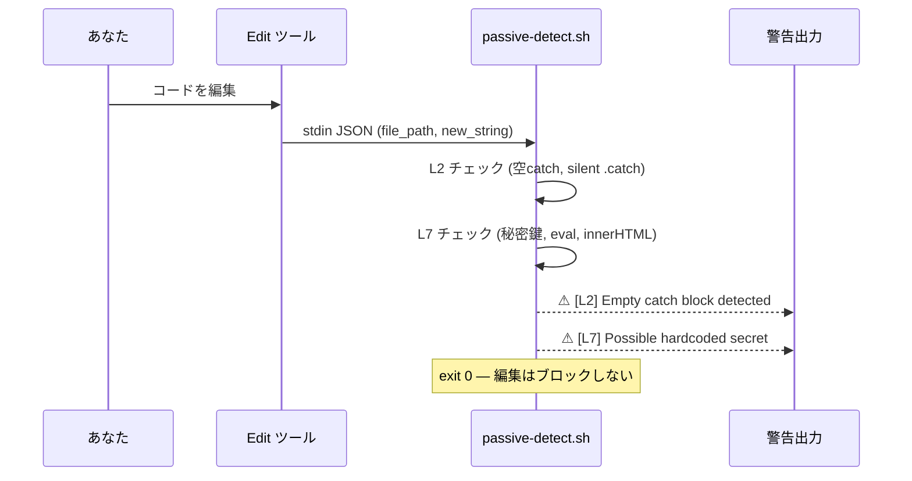

<br>

---

<br>

## Aufheben Agent

> 検出して終わりではない。**検出 → 分類 → 並列修正 → 検証**を一気通貫で実行する。

```
「アウフヘーベンして」
「違和感を見つけて修正して」
```

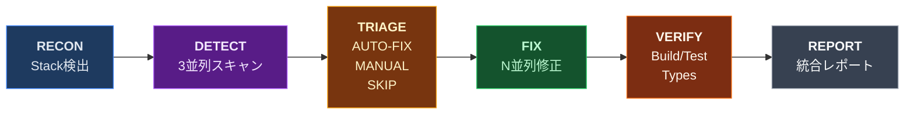

> [!WARNING]
> **安全装置:** `git stash` でスナップショット保存 → `fix/aufheben-{timestamp}` ブランチで作業 → ビルド失敗時は即 revert → 1回の実行で最大 20 件まで

<br>

---

<br>

## 検出パターン: 140

<div align="center">

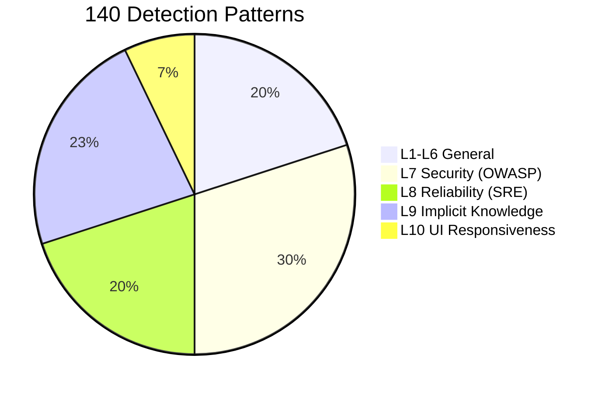

</div>

| Layer | 件数 | カバー領域 |
|:---|:---:|:---|
| **L1-L6** General | 28 | 契約不一致, サイレント失敗, 状態同期, 死機能, 構造矛盾, リソース浪費 |
| **L7** Security | 42 | OWASP 2025 Top 10: アクセス制御, 暗号失敗, インジェクション, 設計, 設定 |
| **L8** Reliability | 28 | SRE パターン: Timeout, Retry Storm, Circuit Breaker, カスケード障害 |
| **L9** Implicit Knowledge | 32 | 12ドメイン: 時間/Unicode/金額/ネットワーク/DB/認証/並行処理 |
| **L10** UI Responsiveness | 10 | Action-Feedback断絶, 写像欠落, アフォーダンス不整合, ダークパターン検出 (5A/3B/2C) |

> [!NOTE]
> **L10 Detection Tiers** — パターンは検出信頼性で3層に分類:
> **Tier A** (5件): grep 単体で高精度。P10.1-P10.4, P10.9
> **Tier B** (3件): grep で候補抽出 → LLM 検証必須。P10.5, P10.7, P10.8
> **Tier C** (2件): LLM 検証フェーズ専用。P10.6, P10.10 (フレームワーク内部処理により grep 不適格)

<br>

---

<br>

## 実例: 本番障害から学ぶ

> これらは仮想の例ではない。**実際に起きた障害**を、このツールの検出レイヤーで再分類したものだ。

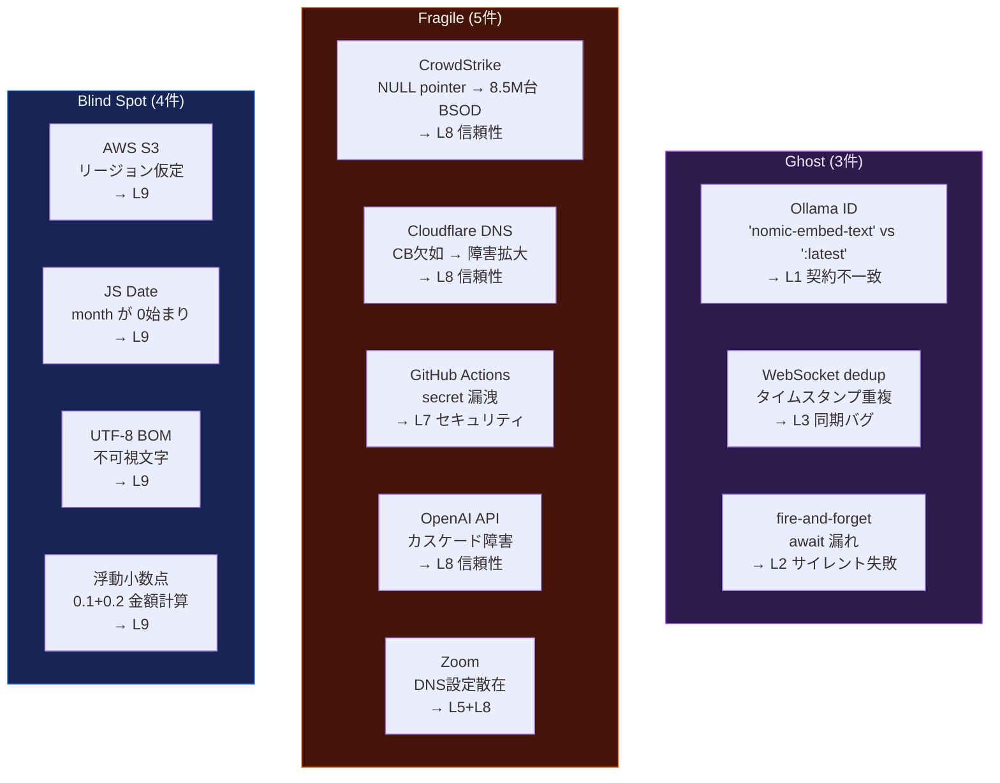

> [!CAUTION]
> **L8 + L9 が 12件中 8件。** 本番で初めて発覚するタイプ。開発環境のテストでは絶対に見つからない。

<br>

---

<br>

## 対応フレームワーク

スタック非依存。プロジェクトを自動検出してクエリを適応。

| Frontend | Backend | Build |
|:---|:---|:---|
| Vue / Nuxt | Node / Express | pnpm |
| React / Next.js | Nitro / Hono | npm / yarn / bun |
| Svelte / Kit | Fastify / tRPC | cargo |
| Angular | Python / FastAPI | go build / pip |
| | Go / Rust | |

<br>

---

<br>

## Research Backing

| Source | 貢献 |
|:---|:---|
| CK Metrics (Chidamber & Kemerer 1994) | CBO/WMC/RFC 閾値のベースライン |
| Shannon Entropy (2025 Springer) | 情報理論ベースの異常検出、60%+ precision |
| JIT Defect Prediction (2024-2025) | プロセスメトリクスの優位性を確認 |
| OWASP Top 10 (2025) | セキュリティ閾値の根拠 |
| Google SRE (2024) | 信頼性パターンの重大度根拠 |
| Eclipse CK Study | CBO=9, RFC=40, WMC=20 の実測値 |

<br>

---

<br>

## File Structure

```
web-anomaly-detector/
├── SKILL.md                        # スキル定義 (エントリポイント)
├── README.md
├── marketplace.json
├── .claude-plugin/
│   └── plugin.json                 # プラグインマニフェスト
├── commands/
│   ├── scan.md                     # /scan コマンド
│   └── score.md                    # /score コマンド
├── hooks/
│   ├── passive-detect.sh           # パッシブ検出フック
│   ├── lm-studio-ensure.sh        # LM Studio 自動起動+モデルロード
│   └── dom-verify.sh              # agent-browser DOM 応答性検証
└── references/
    ├── quantitative-parameters.md  # 18 QAP 定義・公式・閾値
    ├── detection-patterns.md       # L1-L6, L10 grep/glob クエリ集 (140 patterns)
    ├── uiux-semiotics.md           # L10: 論理哲学/記号論/認知心理/行動経済 → 検査項目
    ├── security-patterns.md        # L7: OWASP 2025 — 42 patterns
    ├── reliability-patterns.md     # L8: SRE — 28 patterns
    ├── implicit-knowledge.md       # L9: 12 domains, 32 patterns
    ├── llm-verify.md               # LLM 検証パイプライン仕様
    ├── prompts/                    # カテゴリ別 LLM 検証プロンプト
    └── case-archive.md             # 実例集: 12 本番障害
```

<br>

---

<br>

## Support

<div align="center">

このプロジェクトが役に立ったら:

<br>

[](https://buymeacoffee.com/hitakay123u)

[](https://github.com/sponsors/ohyesiamy)
[](https://github.com/ohyesiamy/web-anomaly-detector)

</div>

<br>

---

<br>

<div align="center">

<sub>Source Available Commercial License (SACL-1.0) — Personal use free / Commercial use requires license</sub>

<sub>語りえぬものを、数えられるものに変換する。</sub>

</div>
