<div align="center">

[](https://buymeacoffee.com/hitakay123u)
[](https://github.com/sponsors/ohyesiamy)
[](https://github.com/ohyesiamy/web-anomaly-detector)

<br>

# Web Anomaly Detector

### コードの「違和感」を数値で暴く — Claude Code Skill

<br>

[](https://github.com/ohyesiamy/web-anomaly-detector/releases)
[](https://claude.ai/code)
[](LICENSE)
[]()
[]()

</div>

<br>

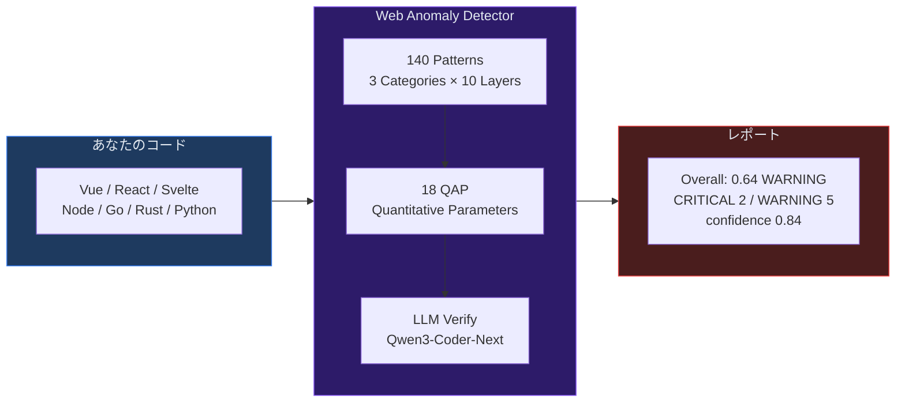

---

## なぜ必要か — 既存ツールの死角

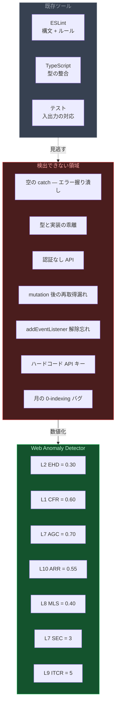

**ESLint がパスし、TypeScript がコンパイルし、テストが通る** のに **本番で壊れる** コード。
それが本スキルの守備範囲。

---

## Quick Start

```bash
# 1. インストール (git clone するだけ)
git clone https://github.com/ohyesiamy/web-anomaly-detector.git \
  ~/.claude/skills/web-anomaly-detector

# 2. Claude Code に話しかけるだけ
```


```
「このプロジェクトの違和感を探して」     → フルスキャン
「システム監査して」                     → フルスキャン
/web-anomaly-detector:score             → スコアのみ (高速)
/web-anomaly-detector:scan diff         → git diff のみ
「アウフヘーベンして」                   → 検出 + 修正まで一気通貫
```

---

## 検出例 — 4つの実例

### 例1: 空の catch ブロック (L2 サイレント失敗)

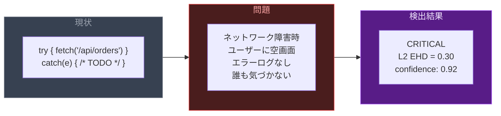

### 例2: 認証なし API (L7 セキュリティ)

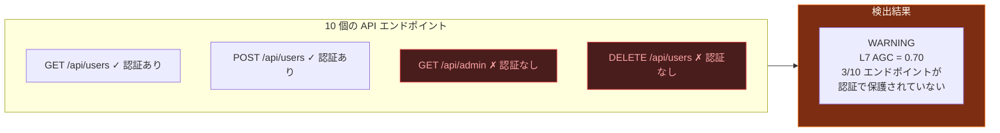

### 例3: ボタンを押しても何も起きない (L10 UI応答性)

```mermaid
sequenceDiagram
    participant U as ユーザー
    participant UI as 画面
    participant API as サーバー

    U->>UI: 「削除」ボタンクリック
    UI->>API: DELETE /api/items/42
    API-->>UI: 200 OK
    Note over UI: ← ここで何も起きない
    Note over UI: loading 表示なし
    Note over UI: リスト更新なし
    Note over UI: 成功メッセージなし
    U->>U: 「...消えてない？」
    U->>UI: ページリロード
    Note over UI: やっとリストから消える

    rect rgb(74, 29, 29)
        Note over U,API: 検出: WARNING L10 ARR = 0.55
    end
```

### 例4: addEventListener の解除忘れ (L8 信頼性)

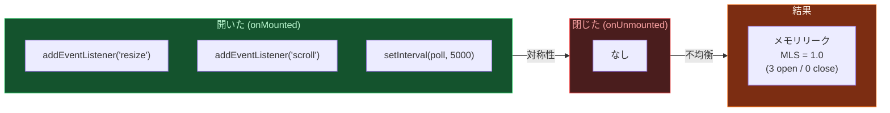

---

## 検出パイプライン — 2-Stage Architecture

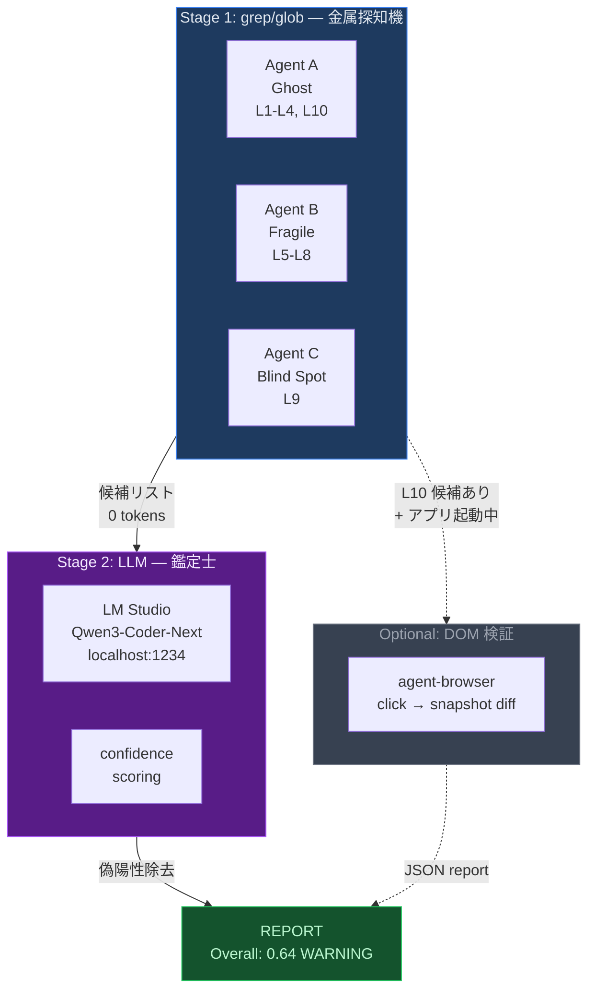

| Stage | 動作 | トークン消費 | 速度 |
|:---:|:---|:---:|:---:|
| **Stage 1** | 3 Explore エージェントが 140 パターンを並列 grep | **0** | ~5s |
| **Stage 2** | Qwen3-Coder-Next が偽陽性を除去 + confidence 付与 | **最小限** (ローカル) | ~20s |
| **DOM** | agent-browser が実際にクリック → accessibility diff | **0** | ~200ms/要素 |

- **LM Studio 自動化**: `lm-studio-ensure.sh` がサーバー起動→モデルロード→ヘルスチェックを**全自動**
- **フォールバック**: LM Studio 未インストール → 自動で grep-only (非ブロッキング)
- **データ送信先**: なし。全て localhost で完結

---

## 3カテゴリ × 10レイヤー

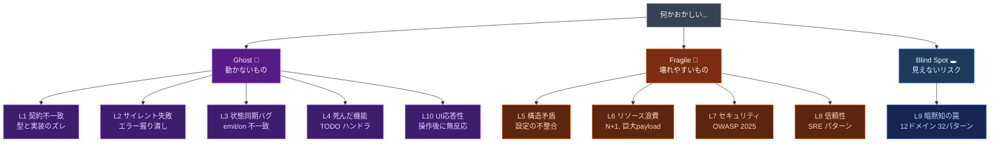

### Ghost — 動かないもの

ユーザーから見て「機能が動いていない」。コードはあるのに、期待通りに動作しない。

| Layer | 何を見つけるか | アナロジー | QAP |
|:---|:---|:---|:---|
| **L1** 契約不一致 | `interface User { email }` だが API は `mail` を返す | 地図にない道路 | **CFR** |
| **L2** サイレント失敗 | `catch(e) {}` — エラーが闇に消える | 電池の抜けた火災報知器 | **EHD** |
| **L3** 状態同期バグ | `emit('user:updated')` / `on('user:update')` | 留守番電話に話し続ける | **ESR** |
| **L4** 死んだ機能 | `onClick={handleDelete}` が TODO のみ | 商品のないボタン | **HLR, RRR** |
| **L10** UI応答性 | 削除押下→リスト更新なし→リロードで消える | 注文後に無言のウェイター | **ARR** |

### Fragile — 壊れやすいもの

今は動いている。変更・負荷・攻撃で容易に壊れる。

| Layer | 何を見つけるか | アナロジー | QAP |
|:---|:---|:---|:---|
| **L5** 構造矛盾 | base URL が `.env` と `config.ts` で違う | 2つの時計が違う時刻 | **NCI, CSS** |
| **L6** リソース浪費 | N+1 クエリ、100KB の未使用 import | 1品ずつレジに並ぶ | — |
| **L7** セキュリティ | 認証なし API、ハードコード秘密鍵、SQLi | 鍵をドアマットの下に | **AGC, SEC** |
| **L8** 信頼性リスク | タイムアウトなし、リトライなし、リソース解放忘れ | ブレーキのない車 | **TCR, RPC, MLS, GSS** |

### Blind Spot — 見えないリスク

コードは正しく「見える」が、暗黙の前提に依存している。

| Layer | 何を見つけるか | アナロジー | QAP |
|:---|:---|:---|:---|
| **L9** 暗黙知の罠 | `getMonth()` = 0始まり、`"👨‍👩‍👧".length` = 8 | 常識とコンピュータの溝 | **TSI, ITCR, BVG, DFS** |

> **L9 の 12 ドメイン**: 時間 / Unicode / 浮動小数点 / 金額 / ネットワーク / DB / 認証 / 並行処理 / ファイルシステム / 暗号 / 正規表現 / ブラウザ API

---

## 18 QAP — 全てを数値化する

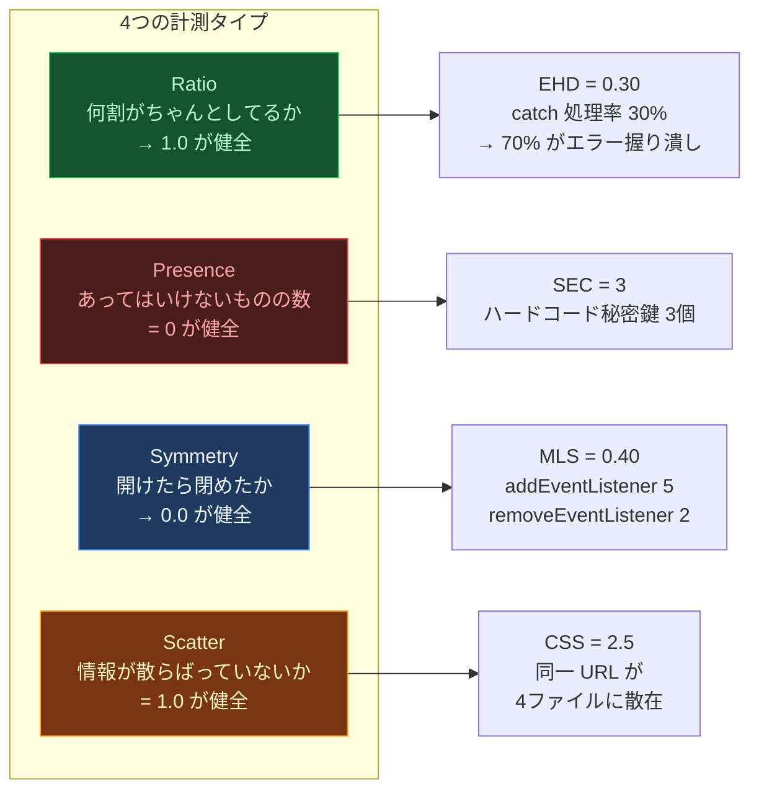

<details>
<summary><b>全18パラメーター一覧</b></summary>

| # | QAP | 名前 | タイプ | Cat | 何を計測するか |
|:---:|:---:|:---|:---:|:---:|:---|
| 1 | **CFR** | 契約一致率 | Ratio | Ghost | 型定義 vs API 実装の一致率 |
| 2 | **EHD** | エラー処理率 | Ratio | Ghost | catch 内でエラーを適切に処理している率 |
| 3 | **ESR** | イベント購読率 | Ratio | Ghost | 定義イベント vs 実際の購読率 |
| 4 | **HLR** | ハンドラ実装率 | Ratio | Ghost | UI ハンドラが実装済み (TODO/空でない) の率 |
| 5 | **RRR** | ルート到達率 | Ratio | Ghost | 定義ルート vs リンクから到達可能な率 |
| 6 | **ARR** | UI応答率 | Ratio | Ghost | アクション後に visible response がある率 |
| 7 | **NCI** | 命名一貫性 | Ratio | Fragile | camelCase/snake_case の混在度 |
| 8 | **CSS** | 設定散在度 | Scatter | Fragile | 同一設定値が何箇所に散在しているか |
| 9 | **TCR** | タイムアウト率 | Ratio | Fragile | HTTP リクエストにタイムアウトが設定されている率 |
| 10 | **AGC** | 認証保護率 | Ratio | Fragile | API エンドポイントが認証で保護されている率 |
| 11 | **SEC** | 秘密鍵露出 | Presence | Fragile | ソースコード内のハードコード秘密鍵の数 |
| 12 | **RPC** | 耐障害率 | Ratio | Fragile | 外部呼び出しにリトライ/CB がある率 |
| 13 | **MLS** | リソース対称性 | Symmetry | Fragile | open/close ペアの対称性 (リーク検出) |
| 14 | **GSS** | シャットダウン | Presence | Fragile | SIGTERM/graceful shutdown の実装有無 |
| 15 | **TSI** | TODO放置率 | Ratio | BlindSpot | 90日以上放置された TODO の比率 |
| 16 | **ITCR** | 暗黙型変換 | Presence | BlindSpot | `==` / `!=` (非厳密比較) の使用数 |
| 17 | **BVG** | バリデーション欠落 | Ratio | BlindSpot | サーバー入力にバリデーションがある率 |
| 18 | **DFS** | 依存管理品質 | Ratio | BlindSpot | lockfile + pinned deps + 安全な scripts |

</details>

### Composite Score

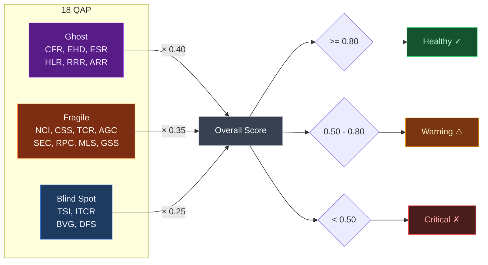

LLM 検証後の補正: `adjusted_QAP = raw_QAP × (0.5 + 0.5 × avg_confidence)`

---

## 出力例

```
## 違和感レポート: my-nuxt-app

### Mode
LLM-verified (Qwen3-Coder-Next / 47件検証)

### Scores
| Category    | Raw  | Adjusted | Status   |
|-------------|------|----------|----------|
| Ghost       | 0.72 | 0.68     | WARNING  |
| Fragile     | 0.85 | 0.83     | Healthy  |
| Blind Spot  | 0.45 | 0.41     | CRITICAL |
| **Overall** | **0.68** | **0.64** | **WARNING** |

### CRITICAL (2件)
| # | Cat | Layer | QAP      | Conf | Location               | Symptom              |
|---|-----|-------|----------|------|------------------------|----------------------|
| 1 | BS  | L9    | BVG=0.40 | 0.88 | server/api/user.ts:17  | バリデーションなし      |
| 2 | G   | L2    | EHD=0.30 | 0.92 | lib/api-client.ts:42   | 空 catch             |

### WARNING (5件)
| # | Cat | Layer | QAP      | Conf | Location               | Symptom              |
|---|-----|-------|----------|------|------------------------|----------------------|
| 1 | G   | L10   | ARR=0.55 | 0.85 | pages/items.vue:31     | 削除後リスト未更新     |
| 2 | F   | L7    | AGC=0.70 | 0.90 | server/api/admin.ts:5  | 認証ガードなし         |
| 3 | F   | L8    | MLS=0.40 | 0.78 | composables/useWS.ts:8 | listener 解除忘れ     |

### LLM Verification Summary
| Metric                 | Value |
|------------------------|-------|
| Total grep matches     | 127   |
| LLM verified           | 47    |
| True positives         | 38    |
| False positives removed | 9    |
| Avg confidence         | 0.84  |
```

---

## 140 検出パターン

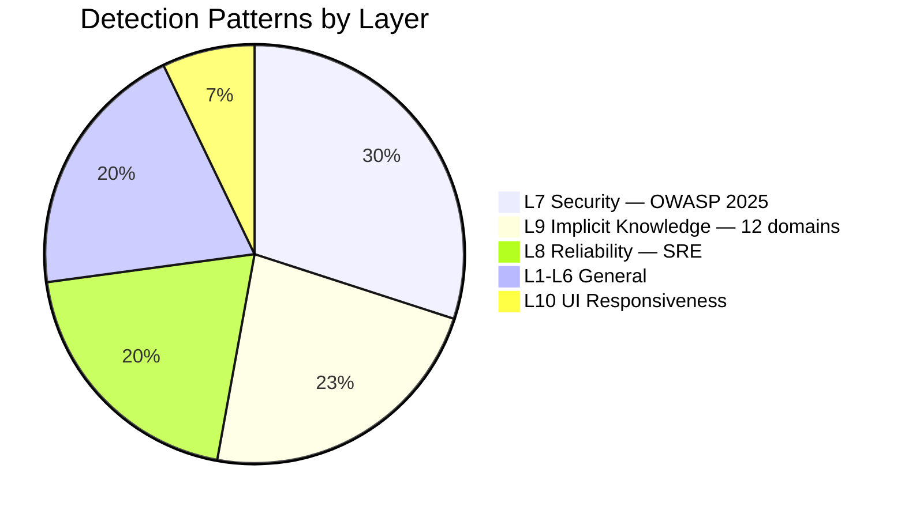

### Tier 分類 — 検出精度の階層

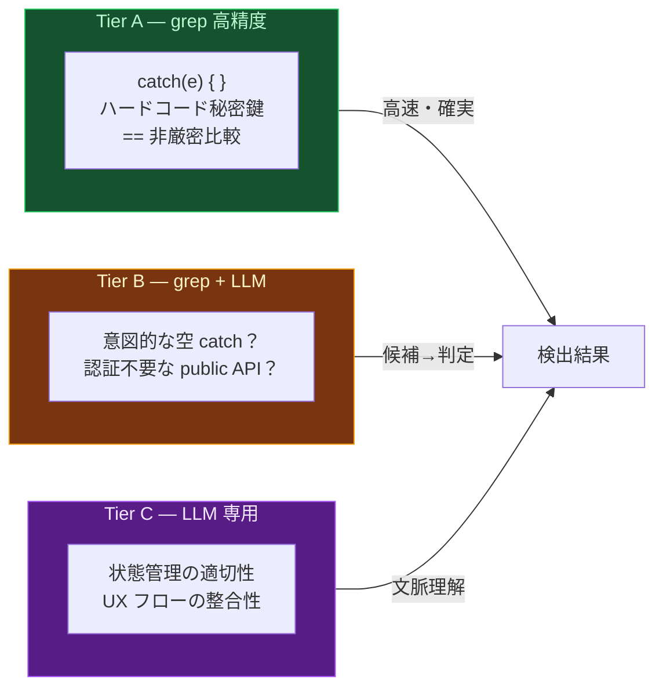

L10 の 10 パターンは **5A / 3B / 2C** — 半数が grep だけで高精度検出可能。

---

## コマンド一覧

| コマンド | 説明 | 速度 |
|:---|:---|:---:|
| `/web-anomaly-detector:scan` | 全体スキャン (3並列 + LLM検証) | ~30s |
| `/web-anomaly-detector:scan diff` | git diff のみ | ~10s |
| `/web-anomaly-detector:scan path:src/api` | 特定ディレクトリ | ~10s |
| `/web-anomaly-detector:scan --grep-only` | LLM 検証なし (v2互換) | ~5s |
| `/web-anomaly-detector:score` | QAP 数値のみ (軽量) | ~3s |
| `/web-anomaly-detector:score --verify` | QAP + LLM 検証 | ~15s |

自然言語でも起動:

```
「違和感を探して」「矛盾がないか確認」「システム監査」「何かおかしい」
```

---

## Aufheben Agent — 検出から修正まで


```
「アウフヘーベンして」→ 検出→分類→並列修正→検証を一気通貫で実行
```

**安全装置**: `git stash` → `fix/aufheben-{timestamp}` ブランチ → ビルド失敗時 revert → 最大 20件/回

---

## パッシブ検出フック

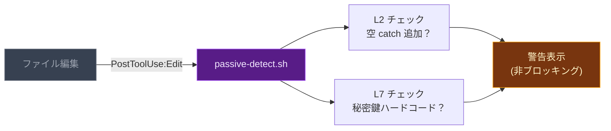

編集するたびに **L2 (サイレント失敗)** と **L7 (セキュリティ)** を自動チェック。編集は止めない。

---

## 対応フレームワーク

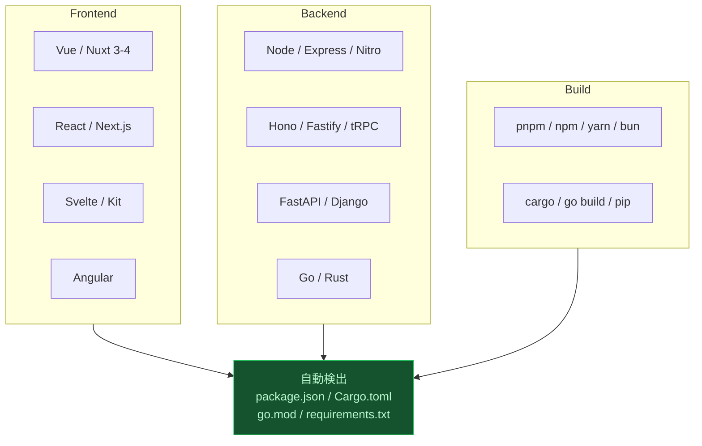

スタック非依存。プロジェクト構成ファイルから自動検出してパターンを適応。

---

## LLM 検証 — 完全ローカル

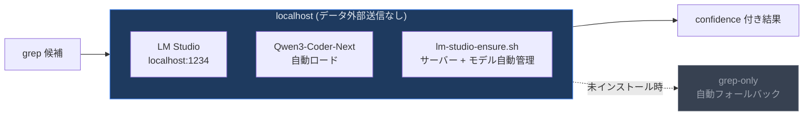

---

## File Structure

```
web-anomaly-detector/
├── SKILL.md                        # エントリポイント (~100行)
├── ABSTRACT.md                     # 哲学的考察 — 違和感の認識論
├── .claude-plugin/plugin.json      # プラグインマニフェスト
├── marketplace.json                # マーケットプレイス情報
│
├── commands/
│   ├── scan.md                     # /scan — 全体スキャン + レポート
│   └── score.md                    # /score — QAP 数値のみ (軽量)
│
├── hooks/
│   ├── passive-detect.sh           # Edit 後の L2+L7 パッシブ検出
│   ├── lm-studio-ensure.sh         # LM Studio 自動管理
│   └── dom-verify.sh               # agent-browser DOM 検証
│
└── references/
    ├── quantitative-parameters.md  # 18 QAP 定義・公式・閾値
    ├── detection-patterns.md       # L1-L6, L10 パターン
    ├── uiux-semiotics.md           # L10: 哲学/記号論/認知心理/行動経済
    ├── security-patterns.md        # L7: OWASP 2025 (42 patterns)
    ├── reliability-patterns.md     # L8: SRE (28 patterns)
    ├── implicit-knowledge.md       # L9: 12 domains (32 patterns)
    ├── llm-verify.md               # LLM 検証パイプライン
    ├── prompts/                    # カテゴリ別 LLM 検証プロンプト
    └── case-archive.md             # 実例: 12件の本番障害
```

---

## Research

| Source | 貢献 |
|:---|:---|
| CK Metrics (Chidamber & Kemerer 1994) | CBO/WMC/RFC 複雑度閾値 |
| Shannon Entropy (2025 Springer) | 情報理論ベース異常検出 |
| OWASP Top 10 (2025) + API Security (2023) | セキュリティパターン・閾値 |
| Google SRE Handbook (2024) | 信頼性パターン・重大度 |
| Bayesian Defect Prediction (Fenton 2012) | 欠陥予測の統計モデル |

> **[違和感について — ひとつの哲学的考察](ABSTRACT.md)**: 感覚的確信の貧困、因果の幻影、生活世界の地盤、判断停止、止揚 — 「違和感」の認識論を8章で考察。

---

<div align="center">

<sub>Source Available Commercial License (SACL-1.0) — Personal use free / Commercial use requires license</sub>

<sub>語りえぬものを、数えられるものに変換する。</sub>

</div>
