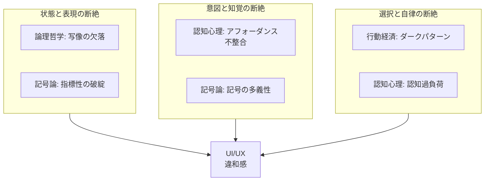

# UI/UX 違和感の多元的分析

コードレベルの違和感 (L1-L9) を超え、**ユーザー体験レベルの違和感**を
4つの理論的レンズで分類し、grep 検出可能な検査項目にアウフヘーベンする。

---

## I. 論理哲学論考 — 写像としての UI

> 「命題は現実の写像である」(2.1)
> 「写像は現実と共通の論理形式を持たねばならない」(2.18)

UI もまた、システム状態の写像である。

ヴィトゲンシュタインの写像理論が UI に課す条件:

1. **構造の同型性** — UI の構造がシステム状態と 1:1 対応する
2. **表現の完全性** — すべてのシステム状態に対応する UI 表現がある
3. **無矛盾性** — UI が同時に矛盾する状態を表示しない

違和感は「写像の破綻」として現れる:

| 破綻タイプ | 意味 | 例 |
|-----------|------|-----|
| **写像の欠落** | 状態はあるが表現がない | エラー状態の UI がない、空リストの表示がない |
| **写像の過剰** | 表現はあるが対応する状態がない | 常に表示されるスピナー、到達不能な UI 分岐 |
| **写像の矛盾** | UI が論理的に矛盾する | 「保存」ボタンが削除を実行する、disabled かつ clickable |

「語りえぬものについては、沈黙しなければならない」(7) — しかし UI において
沈黙は許されない。エラーが起きたとき、空のリストのとき、処理中のとき、
ユーザーは**知る権利**がある。沈黙する UI は、壊れた写像である。

### 導出検査項目 (Tractatus)

| ID | 検査 | grep 着眼点 | 重要度 |
|----|------|-----------|--------|
| T1 | エラー状態の写像欠落 | catch/error handler に UI 更新なし | CRITICAL |
| T2 | ローディング状態の写像欠落 | async 操作に pending 表示なし | WARNING |
| T3 | 空状態の写像欠落 | データ配列の表示に empty state なし | WARNING |
| T4 | 写像の矛盾 | disabled 属性と click handler の共存 | WARNING |

---

## II. 記号論 — 記号の裏切り

> 「これはパイプではない」— マグリット

Peirce の三分法を UI に適用する:

- **Icon** (類似): アイコンは対象に似ている — 🗑️ は「削除」に似ている
- **Index** (因果): スピナーは処理中を**指し示す** — 煙が火を指し示すように
- **Symbol** (規約): 赤は危険 — 文化的な約束事にすぎない

UI の記号体系が壊れる 4つのパターン:

**1. シニフィアン/シニフィエの乖離**
アイコンの見た目 (シニフィアン) と実際の機能 (シニフィエ) が一致しない。
保存アイコンのフロッピーディスクを知らない世代がいるように、記号と意味の
結びつきは恣意的であり、常に乖離のリスクがある。

**2. 指標性の破綻**
ローディングスピナーが回っているが、処理はとっくに完了している。
煙が出ているのに火がない。指標は因果関係に依存するが、
UI では因果関係がしばしばコードレベルで断絶する。

**3. 記号の多義性**
同じアイコンが文脈によって「閉じる」「キャンセル」「削除」を意味する。
✕ は何を意味するか？ — それは文脈が決める。しかし文脈が曖昧なとき、
ユーザーは賭けを強いられる。

**4. 記号体系の混在**
Material Icons と FontAwesome の混在。iOS 慣習と Android 慣習の混在。
異なる記号体系が同一画面に共存するとき、ユーザーは 2つの言語を
同時に読まされる。

### 導出検査項目 (Semiotics)

| ID | 検査 | grep 着眼点 | 重要度 |
|----|------|-----------|--------|
| S1 | 指標性の破綻 | isLoading が実際の async と非連動 | WARNING |
| S2 | 記号体系の混在 | 複数アイコンライブラリの import | INFO |
| S3 | 色記号の矛盾 | success/error に同色クラス使用 | WARNING |

---

## III. 認知心理学 — 知覚と認知の限界

### アフォーダンス (Gibson → Norman)

Gibson が定義し Norman が UI に持ち込んだ「アフォーダンス」。
ドアノブは「回す」ことをアフォードする。ボタンは「押す」ことをアフォードする。

| 状態 | 意味 | 結果 |
|------|------|------|
| **True Affordance** | できることが見える | 正常。ユーザーは迷わない |
| **False Affordance** | できないことが「できるように見える」 | **挫折**。ユーザーは裏切られる |
| **Hidden Affordance** | できることが「見えない」 | **損失**。機能が発見されない |

`cursor: pointer` がついているのにクリックしても何も起きない — False Affordance。
`onClick` があるのにホバー効果もフォーカス表示もない — Hidden Affordance。

### ゲシュタルト原則

- **近接**: 近くにあるものは関連して見える → 関連フォーム項目が分断される違和感
- **類似**: 見た目が似ていると同じグループに見える → 異なる機能の同一スタイル
- **閉合**: 不完全な形を脳が補完する → 意図しないグルーピング

### 認知負荷 (Miller's 7±2)

ワーキングメモリは 7±2 チャンクしか保持できない。
ナビゲーション項目が 12 個。フォームフィールドが 15 個。
CTA ボタンが 5 個。— ユーザーの認知は**飽和**する。

### 導出検査項目 (Cognitive)

| ID | 検査 | grep 着眼点 | 重要度 |
|----|------|-----------|--------|
| C1 | 偽アフォーダンス | cursor:pointer に onClick なし | WARNING |
| C2 | 隠れアフォーダンス | onClick に hover/focus スタイルなし | INFO |
| C3 | 認知過負荷 | nav > 7 items / form > 7 fields | INFO |
| C4 | フォーカス管理欠如 | dialog/modal に focus trap なし | WARNING |
| C5 | タッチターゲット不足 | ボタン/リンク < 44px | WARNING |

---

## IV. 行動経済学 — 選択アーキテクチャの歪み

### プロスペクト理論 (Kahneman & Tversky)

人は利得より損失に **2倍** 敏感。

「登録する」ボタンは大きく、明るい色で配置される。
「退会する」リンクは小さく、グレーで、設定画面の最深部に埋もれている。
これは「デザイン」なのか「欺瞞」なのか？

### ダークパターン (Brignull's Taxonomy)

| パターン | 手法 | 検出可能性 |
|---------|------|-----------|
| **Confirm Shaming** | 拒否を恥ずかしく: 「いいえ、お金は要りません」 | ★★ テキスト分析 |
| **Roach Motel** | 入口は広く出口は狭い: 登録 1 step / 退会 5 steps | ★ フロー比較 |
| **Forced Continuity** | 無料試用→自動課金の隠蔽 | ★★ 規約テキスト |
| **Hidden Costs** | カートの最終段階で費用追加 | ★ フロー分析 |
| **Trick Questions** | 否定の否定: 「通知を受け取らないことを希望しない」 | ★★ テキスト分析 |

### 非対称な摩擦

サービスの核心は「摩擦の非対称性」にある:

```
登録:   Email → パスワード → 完了  (3ステップ)
退会:   設定 → アカウント → 理由選択 → 確認入力 → 最終確認 → 完了  (6ステップ)
```

この非対称性は意図的設計か、それとも違和感か？
検出はコードの構造比較で部分的に可能。

### 導出検査項目 (Behavioral)

| ID | 検査 | grep 着眼点 | 重要度 |
|----|------|-----------|--------|
| B1 | 確認シェイミング | ボタンテキストに否定形・皮肉表現 | WARNING |
| B2 | 操作的デフォルト | checkbox に defaultChecked / checked 属性 | WARNING |
| B3 | 破壊的操作の保護欠如 | delete/remove に confirm dialog なし | CRITICAL |
| B4 | 非対称な摩擦 | 登録 vs 退会のルート/ステップ数比較 | INFO |
| B5 | カウントダウン圧力 | 購入/登録フローに countdown/timer | WARNING |

---

## V. アウフヘーベン — 統合

4つのレンズは個別には「部分」にすぎない。
アウフヘーベンとは:

1. **保存** (aufbewahren): 各レンズの洞察を保持する
2. **否定** (aufheben): 各レンズ単体の限界を超える
3. **高揚** (erheben): より高次の統合的理解に至る

### 三つの断絶

すべての UI/UX 違和感は、以下の 3つの断絶に還元できる:



**1. 状態と表現の断絶** (State-Representation Gap)
システムの真の状態が、UI に正しく反映されていない。
→ 論理哲学の写像欠落 + 記号論の指標性破綻。
→ L10 既存パターン (P10.1-P10.4) + 新パターン (P10.5-P10.6)

**2. 意図と知覚の断絶** (Intent-Perception Gap)
デザイナーの意図が、ユーザーの知覚と一致しない。
→ 認知心理のアフォーダンス不整合 + 記号論の多義性。
→ 新パターン (P10.7-P10.9)

**3. 選択と自律の断絶** (Choice-Agency Gap)
ユーザーが自由に合理的な選択ができない。
→ 行動経済のダークパターン + 認知心理の認知過負荷。
→ 新パターン (P10.10-P10.12)

### 統合検査マトリクス

実世界テスト (kenchiku: Nuxt 4 + Nuxt UI v3) の結果に基づく Tier 分類:

| # | 検査項目 | 断絶 | 源泉 | Tier | 重要度 | 実測精度 |
|---|---------|------|------|------|--------|---------|
| P10.5 | 空状態の写像欠落 | 状態-表現 | T3 | **B** | WARNING | 75%+ (フィルタ後) |
| P10.6 | disabled+clickable 矛盾 | 状態-表現 | T4 | **C** | WARNING | 0% (FW内部処理) |
| P10.7 | 偽アフォーダンス | 意図-知覚 | C1 | **B** | WARNING | 不確定 (要cross-check) |
| P10.8 | フォーカス管理欠如 | 意図-知覚 | C4 | **B** | WARNING | FW依存 |
| P10.9 | 破壊的操作の保護欠如 | 選択-自律 | B3 | **A** | CRITICAL | HIGH (実バグ発見) |
| P10.10 | 操作的デフォルト | 選択-自律 | B2 | **C** | WARNING | N/A (B2B) |
| P10.11 | 確認シェイミング | 選択-自律 | B1 | — | WARNING | 未テスト |
| P10.12 | 隠れアフォーダンス | 意図-知覚 | C2 | — | INFO | 未テスト |

**Tier 定義**: A = grep 単体で高精度 / B = grep + LLM 検証必須 / C = LLM 専用 (grep 不適格)
**注**: P10.11, P10.12 は detection-patterns.md 未実装。理論枠組みとして保持。

### ARR サブコンポーネントへの統合

既存 ARR (Action-Response Rate) の sub-components に第4項を追加:

```
ARR = 0.35 × response_rate        (L10.1-L10.4: 既存)
    + 0.25 × representation_rate   (L10.5-L10.6: 状態-表現の完全性)
    + 0.20 × affordance_rate       (L10.7-L10.9: 意図-知覚の一致性)
    + 0.20 × agency_rate           (L10.10-L10.12: 選択-自律の保護)
```

※ 既存 sub-components (revalidation_rate 0.40, feedback_rate 0.30,
rollback_rate 0.30) から再配分。response_rate は旧3項の統合。

### 理論的根拠の要約

| レンズ | 核心概念 | UI/UX への射影 | 検出原理 |
|-------|---------|--------------|---------|
| 論理哲学 | 写像理論 | UI = システム状態の写像 | 状態と表現の対応を検査 |
| 記号論 | 記号の恣意性 | UI 要素は約束事にすぎない | 記号と意味の一致を検査 |
| 認知心理 | アフォーダンス | 見た目が機能を暗示する | 視覚と操作性の一致を検査 |
| 行動経済 | 選択アーキテクチャ | デフォルトが行動を決める | 自由な選択の保護を検査 |

> これらは異なるものではない。すべて「期待と現実の断絶」の異なる面にすぎない。
> 論理哲学は構造の断絶を見、記号論は意味の断絶を見、認知心理学は知覚の断絶を見、
> 行動経済学は意思決定の断絶を見ている。UI/UX の違和感とは、
> **あらゆるレベルで期待が裏切られること**の別名である。
